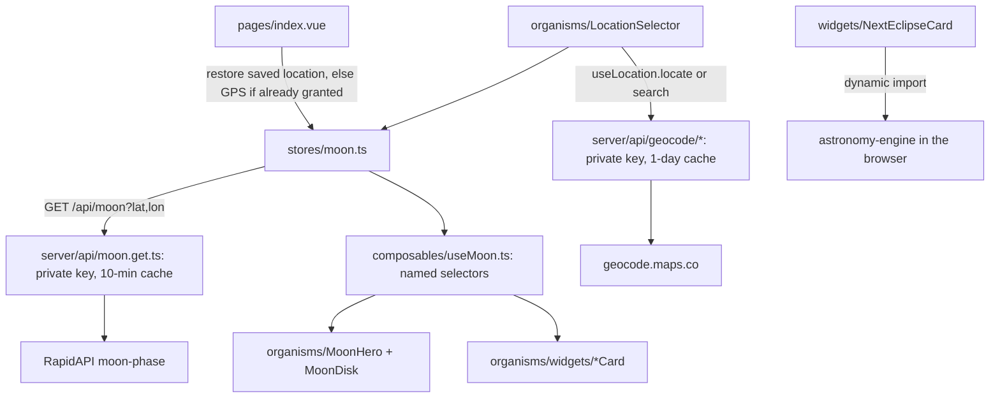
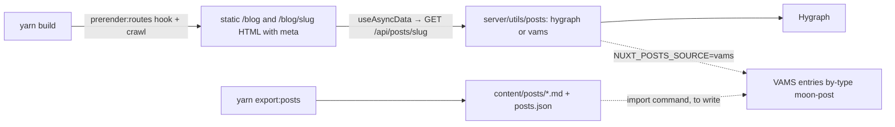

<!--
  PROJECT.md — the cockpit for this repo. One file to open and know where things stand.
  Maintained by the `project-cockpit` skill. The assessment (status/issues/roadmap) is
  refreshed each session; the Diary at the bottom only grows. App-code changes need a
  green light; main is merged to only when sure.
-->
<!-- clickup_list:901508497689 -->

# LUNATRACK (moon-cal) — cockpit

**What it is** · A moon-phase app for moon nerds: tonight's phase, illumination, age, moon/sun sign, rise/set, next full moon, upcoming phases, distance, eclipses and viewing tips, for a chosen or detected location. Plus a blog (30 posts, Hygraph today, VAMS next).
**Stack** · Nuxt 3.21 (hybrid: home client-only, blog prerendered) · Vue 3.5 · Pinia 3 · Tailwind 3.4 · Nitro server routes (API proxies, blog adapters) · astronomy-engine (eclipses, in-browser) · RapidAPI moon-phase · geocode.maps.co · Hygraph (blog, via `server/utils/posts`) · Umami · Netlify
**Status** · 🟢 renewed, not yet shipped — the whole app was rebuilt on 2026-10-01 on branch `renewal-fixes` (atomic design, keys behind Nitro routes, prerendered blog with real meta, fixed geolocation, eclipses computed locally, a11y 100, SEO 100 locally). `yarn build` + `nuxi typecheck` green. **Waiting on Hiren**: merge to `main` + push (deploys), rename the Netlify env vars and rotate the RapidAPI key, add a Hygraph→Netlify build hook. Live site still runs the 2025-04 code until then.
**Repo** · `github.com/Hersh3yy/moon-cal` · Hiren wants **one branch only**: `main`. Work sits on `renewal-fixes` until he merges it (see diary 2026-10-01 for the exact commands); after that, commit straight to `main`.
**Hosting** · Netlify (site `cute-bienenstitch-4060c5` → lunatrack.info), `yarn build` with the Netlify preset (`netlify.toml`): static pages on the CDN, `/api/*` as a function. Env vars: `NUXT_MOON_API_KEY`, `NUXT_GEOCODE_API_KEY` (old `NUXT_PUBLIC_*` names still read as fallback).
**ClickUp** · Lunatrack list `901508497689` — not synced this session (`CLICKUP_API_KEY` unset in this shell)
**Last assessed** · 2026-10-01 (renewal built)

---

## Run it

```bash
yarn install
yarn dev              # http://localhost:3000
yarn build            # Netlify preset locally = node-server; prerenders / , /blog, every post, sitemap, robots
node .output/server/index.mjs   # preview the production build
npx nuxi typecheck    # vue-tsc, must be clean before committing
yarn export:posts     # dump the Hygraph blog to content/ (backup + VAMS import source)
```
Needs `.env` with `NUXT_MOON_API_KEY` and `NUXT_GEOCODE_API_KEY` (see `.env.example`; the legacy `NUXT_PUBLIC_*` names still work). Keys are read only by the Nitro routes under `server/api/`. Blog needs no key. Gotcha: the handler cache persists under `.nuxt/cache` between local builds — the post handlers bypass it during prerender, but if anything else looks stale, `rm -rf .nuxt/cache`. Lighthouse: `npx lighthouse http://localhost:3000/ --only-categories=performance,accessibility,best-practices,seo` (local numbers are pessimistic: no brotli, no CDN).

## Status

Everything from the 2026-10-01 audit is fixed on `renewal-fixes` and verified in the browser (desktop + mobile) and with Lighthouse on the local production build: accessibility **100**, best practices **100**, SEO **100** on the home page and on a post; performance 73 (home) / 70 (post) locally without compression or CDN — the live numbers will be higher, and the remaining home LCP is the SPA nature of the page (empty shell → JS → `/api/moon` → moon image). The moon data is correct (re-verified against the API), the keys are no longer in any HTML, the sitemap lists all 32 URLs, every post ships as static HTML with its own title/description/OG image, geolocation uses the device without a `confirm()` and with correct error messages, and the Next Eclipses card computes real dates (lunar: penumbral 21 Feb 2027, visible from Amsterdam; solar: 2 Aug 2027, 38% from Amsterdam).

What is **not** done: the merge to `main` and the deploy (Hiren's hand), the Netlify env rename + RapidAPI key rotation, and the VAMS side of the blog (entry type + import) — the site's VAMS adapter is written and switched off until then.

## Issues

Open items only. The 2026-10-01 audit's findings (keys public, stale deploy, LCP 25 s, dead eclipse card, blog invisible to scrapers, 5 unnamed buttons, copy-pasted zodiac tables, etc.) are closed on `renewal-fixes`; see the diary for what each one became.

| Sev | Issue | Where |
|---|---|---|
| critical | **RapidAPI key is still public on the live site** until `renewal-fixes` is deployed and the key is rotated. Rotate in RapidAPI, set `NUXT_MOON_API_KEY` (and `NUXT_GEOCODE_API_KEY`) in Netlify, remove the `NUXT_PUBLIC_*` ones. | Netlify env · RapidAPI dashboard |
| serious | **`main` diverged from `origin/main`** (5 ahead, 1 behind: `7ca356a restore the moon`). Merging `origin/main` into `renewal-fixes` conflicts only on `components/TheMoon.vue`, which the branch deleted (replaced by `organisms/MoonDisk.vue`) — resolve by deleting it. | git |
| warning | Home-page LCP is bound by the SPA shell (no HTML until JS + `/api/moon`). Fix options: prerender a daily snapshot of the hero (scheduled Netlify build) or SSR the home with the moon data for the default city and hydrate to the visitor's. | `nuxt.config.ts` routeRules `/` |
| warning | Hygraph free tier rate-limits bursts (429). The adapter fetches all posts once per 10 minutes and retries, so builds pass, but a VAMS move removes the dependency. | `server/utils/posts/hygraph.ts` |
| warning | New posts only appear after a rebuild (blog is prerendered). Add a Hygraph webhook → Netlify build hook; the SSR fallback already serves an unknown slug live. | Hygraph · Netlify |
| cleanup | Two untracked scratch files left for Hiren to delete: `components/widgets/AdWidgetDemo.vue` (references a component that no longer exists) and `public/_robots.txt` (ships as `/_robots.txt`). `SponsorCard.vue` (ex `AdWidget`) exists but is not rendered — decide. | repo root |
| cleanup | Fonts use `font-display: swap` (fontsource default) → small CLS on first paint. Could switch to `optional` or add `size-adjust` fallbacks. | `assets/css/main.css` |

**Packages** (2026-10-01): on nuxt 3.21.11, vue 3.5.43, pinia 3.0.4, tailwind 3.4.19, typescript 5.9.3, vue-router 4.6.4. Removed `@nuxtjs/apollo`, `graphql`, `graphql-request`, `@headlessui/vue`, `@nuxtjs/seo`. Added `astronomy-engine`, `@graphcms/rich-text-html-renderer`, `marked`, `@fontsource/{audiowide,poppins}`, dev `vue-tsc`, `@types/node`. Majors still staged behind the build check: Nuxt 4, Tailwind 4, pinia 4 + @pinia/nuxt 1, @nuxtjs/sitemap 8, @nuxtjs/robots 6.

## Guide

**Shape of the app (after the renewal).** Atomic design under `components/`: `atoms/` (AppLogo, AppIcon, IconButton, Pill, Spinner, ErrorNotice, SkipLink, ZodiacIcon, FullMoonIcon, ProgressRing, StarField), `molecules/` (BaseCard, StatList/StatRow, NavMenu, LocationChip, CityForm, TonightSummary, DistanceGauge, ShareButton, PostMeta, PostCard, HeroSkeleton), `organisms/` (SiteHeader, SiteFooter, AboutModal — a native `<dialog>`, LocationBar, LocationSelector, MoonHero, MoonDisk, WidgetGrid, and `widgets/*Card.vue`). Components are auto-imported by file name (`pathPrefix: false`). Shared tables live in `data/` (zodiac, full-moon names), pure helpers in `utils/` (dates, format), API types in `types/`.

**Data flow.** One Pinia store (`stores/moon.ts`) holds `moonData`, `coordinates`, `cityName`, `locationSource`, and remembers the last location in `localStorage`. Widgets never touch the raw JSON: they read named selectors from `composables/useMoon.ts` (`illuminationPct`, `upcomingPhases`, `distance`, `position`, `tonight`, …). `composables/useLocation.ts` owns geolocation and city search; `composables/useEclipses.ts` lazy-loads `astronomy-engine` in the browser. The browser only ever calls this site's own `/api/*` routes.



**Blog.** Pages call `/api/posts` and `/api/posts/:slug`; `server/utils/posts/index.ts` picks the adapter from `NUXT_POSTS_SOURCE`: `hygraph.ts` (rich-text AST → HTML with `@graphcms/rich-text-html-renderer`, images rewritten to resized WebP `srcset`) or `vams.ts` (VAMS entry type `moon-post`, Markdown body → HTML with `marked`). Both return the same `Post` shape (`types/post.ts`). At build, `/blog` and every post are prerendered (the `prerender:routes` hook lists slugs from Hygraph) and `/sitemap.xml` is generated from `server/api/__sitemap__/urls.get.ts`; an unknown slug falls back to SSR on the Netlify function.



**Domain words (keep them).** `phase` 0→1 (0 new, 0.5 full), `stage` waxing/waning, `illumination` "71%", `age_days`, `lunar_cycle` "71.45%", `upcoming_phases.{new_moon,first_quarter,full_moon,last_quarter}.{last,next}` with `timestamp`, `days_ahead`/`days_ago` and, for full moons, `name` + `description`; `zodiac.{sun_sign,moon_sign}`; `detailed.position.{altitude,azimuth,distance,parallactic_angle}` — **distance is in metres**; `detailed.visibility.*` and `events.optimal_viewing_period` carry the viewing prose; `sun.{sunrise_timestamp,sunset_timestamp}` are pre-formatted `"07:41"` strings, bare `sunrise`/`sunset` are epoch seconds.

## Hard parts

### Drawing a moon at the right phase

🔭 **What it does** — A moon-phase image is a full-moon sprite with a shadow mask laid over it. The terminator (the light/dark boundary) is a half-ellipse whose horizontal radius tracks `|cos(2π·phase)|`: at new or full it's the full disc width, at the quarters it collapses to a straight line. `stage` picks the lit side (waxing = right, waning = left, northern hemisphere). The fix on `renewal-fixes` also closes the end-of-cycle wrap: `phase → 1` is new, not full.

⚖️ **Why this way** — The API gives `phase` and `stage`; deriving the terminator from them is 20 lines and exact. A phase-indexed image set (the README's old idea) is 30 PNGs and still jumps between frames. `MoonDisk` now mirrors the disc for `lat < 0`; the rotation still uses the parallactic angle, an approximation of the bright-limb position angle.

🗣️ **Say it to a senior** — "The moon is a sprite under an SVG mask; the terminator is an ellipse whose x-radius is |cos| of the phase angle, the lit side comes from the waxing/waning stage, and we still owe southern-hemisphere viewers a flip."

---

### Why the API key is on every visitor's screen

🔭 **What it does** — Nuxt serialises everything under `runtimeConfig.public` into a `<script>` in the HTML (`window.__NUXT__.config.public`) so the client bundle can read it — by design, public means public. In an `ssr: false` app it's tempting to think "there is no server", but Netlify still deploys Nitro as a function, so a file at `server/api/moon.get.ts` runs server-side with a *private* `runtimeConfig.moonApiKey`, and the browser only ever calls `/api/moon`. Wrapping the handler in `cachedEventHandler` with a key of lat/lon rounded to two decimals means a thousand Amsterdam visitors cost one RapidAPI call per ten minutes.

⚖️ **Why this way** — The alternative (RapidAPI referer/domain restriction) doesn't exist for RapidAPI keys, and obfuscation isn't security. The proxy also fixes a second thing: today each visitor's first paint waits on an uncached third-party call.

🗣️ **Say it to a senior** — "Public runtime config is shipped to the browser by definition; the key belongs behind a Nitro route, which Netlify runs as a function regardless of ssr:false, and the route's cache turns N visitors into one upstream call."

---

### Why a date shows the wrong day

🔭 **What it does** — `new Date('2025-02-14')` parses a date-only string as **UTC midnight**; `toLocaleDateString()` then renders it in the *viewer's* timezone, so anyone west of Greenwich sees 13 February. Fixed everywhere via `utils/dates.ts` `parseDate`, which parses date-only strings as local midnight; the old `new Date(0)` fallback is gone.

⚖️ **Why this way** — Parse date-only strings as local (`new Date(y, m-1, d)`) or format with `timeZone: 'UTC'`, and never fall back to epoch 0.

🗣️ **Say it to a senior** — "Date-only ISO strings parse as UTC midnight and render in the viewer's zone, so they drift a day; parse them as local and treat a missing timestamp as missing, not as 1970."

---

### Why shared blog links show the wrong card

🔭 **What it does** — With `ssr: false` every route serves the same empty shell; the post's title, description and image are injected by JavaScript after Apollo answers. Googlebot executes JS (slowly, in a second wave), but WhatsApp, iMessage, Slack, X and Facebook scrapers do not — they read the first HTML response, which carries only the generic "Lunatrack - Your Lunar Guide" tags. The sitemap has the same blind spot: `@nuxtjs/sitemap` only knows routes it can discover at build time, and dynamic `[slug]` pages need a `sources` endpoint that lists them.

⚖️ **Why this way** — Prerendering the blog at build (`ssr: true` globally, `routeRules: { '/': { ssr: false } }` to keep the API-driven home client-only, and a `prerender:routes` hook that queries Hygraph) gives each post real HTML with real meta on the CDN, no server at runtime. Full SSR on Netlify functions would also work but adds cold starts and a runtime dependency on Hygraph for every hit.

🗣️ **Say it to a senior** — "Social scrapers don't run JavaScript, so a client-rendered post always shares as the homepage card; prerendering the blog at build time fixes the meta, the sitemap and the crawl budget in one move."

---

### Why "use my location" used to fail even when allowed

🔭 **What it does** — Three things were wrong at once. `GeolocationPositionError` is not an `Error`: it has a numeric `code` (1 denied, 2 unavailable, 3 timeout) and no `name`, so the old `err.name === 'NotAllowedError'` branches never matched and every failure read "Failed to get location". `enableHighAccuracy: true` with a 10 s timeout asks a laptop for a GPS-grade fix it cannot produce, so it timed out. And a `window.confirm()` plus an `await permissions.query()` sat between the click and `getCurrentPosition`, which Safari treats as "not user-initiated". `useLocation.locate()` now calls `getCurrentPosition` first thing in the click handler, low accuracy with a 5-minute `maximumAge`, retries high accuracy only on a timeout, and maps `code` to a sentence that tells the user what to do. On first load it only geolocates silently when `permissions.query` says `granted`; otherwise Amsterdam, with a hint.

⚖️ **Why this way** — Prompting on page load is the fastest way to a permanent "block", and a `confirm()` before the browser's own prompt is a second dialog for nothing.

🗣️ **Say it to a senior** — "The geolocation error object isn't an Error, high accuracy times out on desktops, and Safari wants getCurrentPosition inside the click — fix those three and 'allowed' actually works."

---

### Eclipses without an eclipse feed

🔭 **What it does** — The API dropped its eclipse fields, so the card computes them. `astronomy-engine` (Meeus-grade, ~110 KB, loaded on demand) gives `SearchLunarEclipse(now)` for the next lunar eclipse anywhere; whether *you* can see it is a separate question answered by the Moon's altitude at the peak: `Equator(Body.Moon, peak, observer)` → `Horizon(...)`, altitude > 0 means it is up for your coordinates. For the Sun, `SearchLocalSolarEclipse(now, observer)` already searches from your location and reports the obscuration you would see (Amsterdam, 2 Aug 2027: partial, 38%). Verified against the known 2026 eclipses (3 Mar total, 28 Aug partial, 12 Aug solar 88% from Amsterdam).

⚖️ **Why this way** — A hand-maintained eclipse table goes stale and cannot say "visible from here"; a local ephemeris can, and it is the same library that would let the whole site drop RapidAPI later.

🗣️ **Say it to a senior** — "We compute eclipses locally: global lunar search plus the Moon's altitude at maximum for visibility, and a local solar search that gives the obscuration for the visitor's own coordinates."

## Roadmap — near future

Triage: n6–n9 and n12 are small, safe, high-confidence — one or two sittings total with a green light. n10, n11 and n13 are real work with decisions in them.

- [x] Fix the moon image: correct the end-of-cycle inversion and draw the terminator from illumination %, or swap to a phase-indexed image set (the README's "accurate moon images for each day") <!-- id:n1 cu:123kjkdhp64 -->
- [x] Fix MoonSign to stop showing sun-sign date ranges (drop the month span, or show the ~2-day moon transit) <!-- id:n2 cu:123kjkdhp65 -->
- [x] ~~Format sun/moon rise-set times~~ — **verified already correct**: the time widgets use the API's pre-formatted string fields (`"06:59"`, `"00:10"`), not the epoch fields. The audit over-flagged this; nothing to change. <!-- id:n3 cu:123kjkdhp66 -->
- [x] Fix date rendering: no 1970 fallback, parse date-only strings without the UTC off-by-one, show the location's day not the viewer's <!-- id:n4 cu:123kjkdhp67 -->
- [x] Replace the `lastIndexOf('}}')` truncation with `response.json()`; surface the missing-field warning instead of swallowing it <!-- id:n5 cu:123kjkdhp68 -->
- [ ] **Merge + ship (Hiren).** Commit the WIP (`nuxt.config.ts` site/sitemap/robots, card shadow, `AdWidget.vue`); delete scratch `AdWidgetDemo.vue` + `public/_robots.txt`; merge `origin/main` into `renewal-fixes` taking the branch's `TheMoon.vue`; `yarn build`; merge to `main`, push (Netlify deploys the moon fix); delete `renewal-fixes`; continue on one new branch `renewal-2`. <!-- id:n6 -->
- [x] **Hide the API keys.** `server/api/moon.get.ts` + `server/api/geocode.get.ts` with private `runtimeConfig.moonApiKey`/`geocodeApiKey`, `cachedEventHandler` (10 min, lat/lon rounded to 2 dp), store + composables call `/api/*`; `.env.example` updated; **rotate the RapidAPI key** after deploy. Done in code; **rotate the RapidAPI key + rename the Netlify vars** after deploy. <!-- id:n7 -->
- [x] **Quick-fix batch** (all small, all safe, one sitting): `aria-label` on the 5 icon buttons, `aria-expanded` on the hamburger, Escape + focus trap + focus return on the About modal, a real `<label>` for the city input, `alt=""` on decorative zodiac/full-moon icons, an `<h1>` on the home page, absolute `og:image`, drop the `SearchAction` + the 404 logo from JSON-LD, canonical from `route.path`, `themeColor` dark + `colorScheme 'dark'`, parse blog dates as local, filter empty tags, strip `console.log`, delete `SunMoonSign`/`SunMoonTimes`/dead CSS/7 unused PNGs/3 dead deps/`graphqlEndpoint`/`moon_phases` fallback, define `font-helvetica` or drop it, dark `error.vue`, rename package to `lunatrack`, replace `window.confirm` with an inline hint. <!-- id:n8 -->
- [x] **Performance.** Resize `starry-background.jpg` to 1920 w AVIF + WebP (~150–250 KB) via `@nuxt/image` or a committed file; fonts via `@nuxtjs/google-fonts` (preload, `display=swap`) or self-host Audiowide + Poppins; `preconnect` to the API host. Done: 1280/1920 AVIF+WebP, fonts self-hosted via fontsource, Hygraph images as WebP srcset. Verify the live Lighthouse after deploy; home LCP is now bound by the SPA shell (see Issues). <!-- id:n9 -->
- [x] **Atomic design restructure.** `components/atoms` (Logo, IconButton, Stat, Pill, Spinner), `molecules` (StatRow, CardHeader, LocationChip, NavMenu, PhaseCountdown), `organisms` (SiteHeader, MoonHero, LocationSelector, AboutModal, WidgetGrid, the widgets); `components: [{ path: '~/components', pathPrefix: false }]`; one shared `data/zodiac.ts` + `data/fullMoons.ts`; `types/moon.ts` extracted from the store; a `useMoon()` composable of named selectors (illumination %, next phases, distance context) so widgets stop reaching into raw JSON; remove the `mode`/`displayMode` plumbing; design tokens in `tailwind.config.js` (ink, surface, glow, display/body fonts); one `Header`. Done when every widget is < 40 lines and no data table is duplicated. <!-- id:n10 -->
- [x] **Blog SEO + hygiene.** `ssr: true` with `routeRules '/': { ssr: false }`; prerender `/blog` + every `/blog/[slug]` from Hygraph via a `prerender:routes` hook; `sitemap.sources` server route listing posts; per-post absolute OG image; `@graphcms/rich-text-vue-renderer` instead of `renderContentJson`; `useAsyncQuery` at setup level, not in `onMounted`; dark-theme blog cards + `text-gray-*` → tokens; real share button (Web Share API + copy link); reading time. Done when a shared post link previews with its own title/image and `sitemap.xml` lists every post. <!-- id:n11 -->
- [x] **Fix Next Lunar Eclipse.** Ship a local table of lunar (and solar) eclipses 2026–2030 from the NASA canon with type + visibility regions, pick the next one after today; or compute via `astronomy-engine` (see f9). Done when the card shows a real date. <!-- id:n12 -->
- [x] **Package currency.** Took the minors/patches (`yarn upgrade` nuxt 3.21, vue 3.5.43, typescript 5.9, pinia 3.0.4, tailwind 3.4.19, graphql 16.14, postcss, autoprefixer) and verify with `yarn build`; then stage each major separately behind the build: Nuxt 4, Tailwind 4, pinia 4 + @pinia/nuxt 1, sitemap 8, robots 6, TypeScript 7. Dropped `@nuxtjs/seo` and Apollo; majors (Nuxt 4, Tailwind 4, pinia 4, sitemap 8, robots 6) still staged. <!-- id:n13 -->

- [ ] **VAMS blog hookup.** In VAMS: seed entry type `moon-post` (slug, excerpt, body as Markdown, tags, author, cover image_collection, gallery, reference_urls) like `ItamarWebsiteSeeder`, plus an `hygraph:import-lunatrack-blog` command that reads `content/posts.json` (or the `.md` files) and creates published entries for the Lunatrack user; grant the type; copy the user's API key. On Netlify: `NUXT_POSTS_SOURCE=vams`, `NUXT_VAMS_API_KEY`, redeploy. The site-side adapter (`server/utils/posts/vams.ts`) is already written. <!-- id:n14 -->
- [ ] **Deploy hygiene.** Hygraph webhook → Netlify build hook (new posts appear without a manual deploy); delete the two scratch files; decide the sponsor card. <!-- id:n15 -->

## Roadmap — far future

Tracks, not a schedule. f7/f8 are the "more stats" you asked for; f9 is the strategic one that unlocks f10, f13 and f15.

- [x] Remove dead code: deleted `stores/posts.ts`, `DebugInfo.vue`, `ModeToggle.vue`, the duplicate `useMoonImage.ts` (all zero importers). The redundant second header (`layout/Header` vs `App/Header`) was left — it's layout tidy-up, not dead code; spin off if wanted. <!-- id:f1 cu:123kjkdhp69 -->
- [x] Sanitize blog `v-html` (XSS) — the hand-rolled renderer is gone; HTML comes from `@graphcms/rich-text-html-renderer` (escaped) server-side <!-- id:f2 cu:123kjkdhp6a -->
- [x] Auto-detect location on first load when permission is already granted; the last location is remembered in `localStorage`; a hint explains the target button otherwise <!-- id:f3 cu:123kjkdhp6b -->
- [x] Document the required API keys in `.env.example` <!-- id:f4 cu:123kjkdhp6c -->
- [x] Decide SPA vs SSR for blog SEO — hybrid: prerendered blog, client-only home <!-- id:f5 cu:123kjkdhp6d -->
- [ ] 3D moon render + i18n (README TODOs; favicon exists, title done). 3D: `three` + NASA CGI Moon Kit colour + displacement maps (~600 KB, lazy-loaded behind a "3D" toggle), lit from the real sun direction (`phase_angle`). i18n: `@nuxtjs/i18n` with `en` + `nl`. <!-- id:f6 cu:123kjkdhp6e -->
- [ ] **Stats pack A — already in the API, zero new fetches.** Done in the renewal: (1) moon position now (altitude + compass) in the Moon card, (2) cycle ring around the hero, (3) next-four-phases card, (4) last full moon line, (5) distance gauge + supermoon hint, (6) angular size, (7) observer's kit, (8) solar noon. Still open: a 24-hour sky timeline bar (sun band + moon band), sun altitude/Earth–Sun distance, golden/blue hour, the nerd row (phase angle, visible fraction). Original list: (1) *Moon position now*: `detailed.position.altitude/azimuth` → "Below the horizon · rises 21:02 in the NNE" with a compass rose. (2) *Lunar-cycle ring* around the hero moon from `lunar_cycle` %. (3) *Next-four-phases strip*: new / first quarter / full / last quarter with `days_ahead` countdowns — the "moon calendar" people search for. (4) *Last full moon*: "Harvest Moon, 4 days ago" from `full_moon.last`. (5) *Distance gauge* perigee 356k ↔ apogee 406k km with a "supermoon" badge when a full moon falls within ~90% of perigee. (6) *Angular size*: `2·atan(1737.4 / distance_km)` in arcminutes vs the 31.1′ mean — "3% bigger than average tonight". (7) *Observer's kit*: `visibility_rating`, `visible_hours`, `recommended_equipment` (telescope, magnification, filter). (8) *Sun extras*: solar noon, Earth–Sun distance (`sun.position.distance`, perihelion/aphelion context), sun altitude now, golden/blue hour derived from sunrise/sunset. (9) *24-hour sky timeline*: one bar with the sun band and the moon band — replaces the two time cards with one visual. (10) Nerd row: `phase_angle`, `visible_fraction`. <!-- id:f7 -->
- [ ] **Stats pack B — computed locally, no API.** *Tides*: spring tides at new/full, neap at the quarters (from `phase`). *Earthshine*: when illumination < ~25%, "look for the ghostly dark side just after sunset". *Blue moon*: two full moons in one calendar month, from `upcoming_phases`. *Lunation number* (Brown): `floor((JD − 2451550.1) / 29.530588853) + 953`. *Hemisphere-correct moon*: flip the mask for `lat < 0` and say "this is how it looks from where you are". *Lunar-calendar holidays*: Ramadan/Eid, Chinese New Year, Easter (first Sunday after the first full moon after 21 March), Diwali — all derivable from new/full-moon dates. <!-- id:f8 -->
- [ ] **Local ephemeris with `astronomy-engine`** (MIT, ~100 KB, Meeus-grade): phases, illumination, rise/set, ecliptic longitude → zodiac sign, lunar/solar eclipse search, perigee/apogee, positions — all offline. Removes the RapidAPI dependency (the key problem, the quota, and the three "API response changed again" commits in history), keeps the API's prose (full-moon names, viewing tips) as small local tables, and makes unlimited prerendered pages free. Also unlocks a *time scrubber* ("drag to see the moon over the next 30 days") and "the moon on your birthday". Stage behind a side-by-side comparison with the API for a month. <!-- id:f9 -->
- [ ] **Programmatic SEO pages** (needs f9 or careful API budgeting): `/full-moon-calendar/2026` (and per year), `/moon-phase-today`, `/moon/<city>` for the top ~50 cities, `/moon-phase/<YYYY-MM-DD>`, each prerendered with its own title/description/OG — "full moon october 2026" is the traffic magnet. A daily Netlify scheduled build hook so the prerendered home carries today's phase in its title ("Waning gibbous 71% · Moon phase today"). `nuxt-og-image` to render today's moon card for shares. <!-- id:f10 -->
- [ ] **Glossary / FAQ pages** with `FAQPage` JSON-LD: one explainer per phase name, "star sign vs moon sign", "what is a supermoon"; and internal links from each widget to its explainer or blog post (MoonSign → the star-vs-moon-sign post). <!-- id:f11 -->
- [ ] **PWA**: `@vite-pwa/nuxt` manifest + install prompt; later a "full moon tonight" push notification. Moon nerds check daily — a home-screen icon is the retention play. <!-- id:f12 -->
- [ ] **Design polish**: a one-line "Tonight" summary above the fold ("Waning gibbous, 71% lit, rises 21:02 in the NNE, best after 22:00"); glow intensity tied to illumination; subtle CSS parallax starfield (reduced-motion aware); Audiowide for numbers only, Poppins for prose; related posts by tag on the blog. <!-- id:f13 -->
- [ ] **Sponsor slot decision**: `AdWidget.vue` (uncommitted) — keep one clearly-labelled "Sponsor" card at the grid's end, or drop it. <!-- id:f14 -->
- [ ] **Hygraph hygiene**: add `seoTitle`/`seoDescription`/`updatedAt` to the Post model (so `dateModified` is honest), clean the empty tag on the sleep post, add `readingTime` or compute it. <!-- id:f15 -->

---

## Diary

### 2026-10-01 (later) — the renewal, built (branch `renewal-fixes`, not merged)
- Green light from Hiren with three steers: only a `main` branch, talk in plain words (no roadmap ids in chat), priorities accessibility / SEO / responsiveness / working geolocation; later "atomic design all the way" and "hook the blog up to VAMS".
- **Rebuilt the app**: atomic `components/{atoms,molecules,organisms}` with `pathPrefix: false`; one `data/zodiac.ts` + `data/fullMoons.ts` (the API says "Hunter's Moon" with an apostrophe — the old map missed it and showed the wolf icon); `useMoon()` selectors; `useLocation()` (geolocation fixed: `code`-based errors, low-accuracy first, no `confirm()`, silent auto-locate only when already granted, location remembered); native `<dialog>` About modal; every icon button named; `h1` on the home page; dark `error.vue`; design tokens in `tailwind.config.js`; fonts self-hosted (fontsource).
- **Keys**: `/api/moon`, `/api/geocode/search`, `/api/geocode/reverse` with private runtime config and `defineCachedEventHandler`; verified the production HTML contains no key.
- **Blog**: Apollo + graphql removed; `server/utils/posts/{hygraph,vams}.ts` adapters behind `NUXT_POSTS_SOURCE`; `ssr: true` with `/` client-only; 30 posts prerendered with their own meta, JSON-LD, canonical, absolute OG; sitemap with 32 URLs; Hygraph images served as resized WebP `srcset` (486 KB PNG → 19 KB); share button; reading time; dates parsed as local. Hygraph 429'd a 30-request burst — the adapter now fetches all posts once per 10 minutes with retries, and the post handlers bypass the persisted cache during prerender (a stale `.nuxt/cache` bit me once).
- **Eclipses**: `astronomy-engine`, lazy-loaded; verified against the 2026 eclipses. **Distance** was shown in metres as km ("369,320,415 km") — now `/1000`.
- **Assets**: starfield 4.3 MB → 1280/1920 AVIF+WebP (61–149 KB); 7 unused moon PNGs deleted; `full-moon.webp`; `og-default.jpg` 1200×630, `logo.png`, `apple-touch-icon.png`, `favicon.svg` rendered with headless Chrome. `netlify.toml` (Node 22, `yarn build`, publish `dist`).
- **Verified**: `yarn build` green (66 routes prerendered), `nuxi typecheck` clean, browser checks on desktop + mobile (home, city search → Lisbon, About modal + Escape, blog index, post), local Lighthouse: a11y 100 / BP 100 / SEO 100 on home and post, perf 73 / 70 locally (no brotli, no CDN).
- **Not done / Hiren's hand**: the auto-mode classifier refused the git merge + branch delete, so `renewal-fixes` is unmerged and unpushed; the RapidAPI key is still public on live until deploy + rotation; two untracked scratch files left (`AdWidgetDemo.vue`, `public/_robots.txt`); VAMS entry type + import not created (needs VAMS prod + a key); ClickUp not synced.

### 2026-10-01 — full re-assessment for the renewal (no code changed)
- Re-read every source file, called the live API (data correct: Waning gibbous · 71% · Gemini), loaded the live site desktop + mobile, ran Lighthouse (mobile: perf **68**, a11y **88**, best-practices 100, SEO 100; LCP **25.0 s**, 4,749 KiB), checked the live sitemap (2 URLs, no posts), robots (fine), Hygraph (8 posts). `yarn build` green on Node 24.19.
- **Found**: live site runs `origin/main` from 2025-04 — the 2026-09-06 fixes never shipped; local `main` diverged (5 ahead / 1 behind, `TheMoon.vue` conflict). Both API keys readable in the live HTML. Next Lunar Eclipse card dead (API dropped the field). Blog posts invisible to scrapers and absent from the sitemap. Uncommitted WIP on `renewal-fixes` (site/sitemap config, card shadow, `AdWidget.vue`, scratch demo + `_robots.txt`).
- Rewrote the map: issues table regrounded, two Mermaid diagrams (today / target), two new hard-parts blocks (public runtime config; why shared links show the wrong card), roadmap re-cut into n6–n13 (triaged small-safe vs real work) and f7–f15 (stats packs A/B, local ephemeris, programmatic SEO, PWA, polish). README rewritten as the public face (the stale TODO list is gone; roadmap lives here).
- Not done: no app code touched (awaiting green light); ClickUp not synced (`CLICKUP_API_KEY` unset); the RapidAPI key is still live and public until n7 ships.

### 2026-09-06 (later) — fixed it all (branch `renewal-fixes`)
- Green-lit full fix pass, on a branch (not merged). Fixed: the **moon image** (terminator now scales with illumination; the end-of-cycle bright-instead-of-dark inversion is gone — verified numerically across the phase cycle); the **moon sign** no longer prints a month-long sun-sign range; **NextFullMoon** date is formatted and guarded (no "1/1/1970"); the store **fetch** uses `response.json()` instead of the `}}` truncation; deleted 4 dead files. `.env.example` documented. `yarn build` green on Node 24.
- Grounded correction: re-called the live API and found the **time widgets were already correct** (they use the API's pre-formatted `"06:59"` strings, not the epoch fields) — the first audit over-flagged them. NextEclipse already guards its missing case.
- Left as tasks (secondary): blog `v-html` XSS, first-load location auto-detect, SPA-vs-SSR for blog SEO, the redundant second header.

### 2026-09-06 — first cockpit + grounded audit
- Audited the whole app and **called the live moon API** to check the "bad data" complaint. Finding: the API data is correct; the bad data is the display layer (moon image inversion, moon-sign showing sun-sign ranges, raw/timezone-wrong times/dates).
- Corrected the audit's headline: the JSON-truncation hack is latent, not currently losing data (this response ends `}}}}`).
- No code changed — assessment only, pending green light. Roadmap leads with the three visible bugs.
