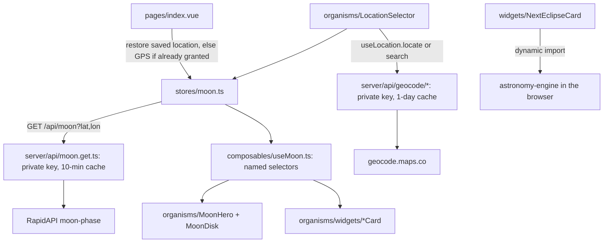
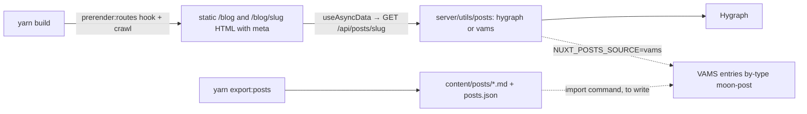

<!--
  PROJECT.md — the cockpit for this repo. One file to open and know where things stand.
  Maintained by the `project-cockpit` skill. The assessment (status/issues/roadmap) is
  refreshed each session; the Diary at the bottom only grows. App-code changes need a
  green light; main is merged to only when sure.
-->
<!-- clickup_list:901508497689 -->

# LUNATRACK (moon-cal) — cockpit

**What it is** · A moon-phase app for moon nerds: tonight's phase, illumination, age, moon/sun sign, rise/set, next full moon, upcoming phases, distance, eclipses and viewing tips, for a chosen or detected location. Plus a blog (30 posts, Hygraph today, VAMS next).
**Stack** · Nuxt 3.21 (hybrid: home client-only, blog prerendered) · Vue 3.5 · Pinia 3 · Tailwind 3.4 · Nitro server routes (API proxies, blog adapters) · astronomy-engine (eclipses, in-browser) · RapidAPI moon-phase · geocode.maps.co · Hygraph (blog, via `server/utils/posts`) · Umami · Netlify
**Status** · 🟢 shipped 2026-10-02 — the renewal is on `main` and pushed (Netlify deploys from it). Atomic design, keys behind Nitro routes, prerendered blog with real meta, fixed geolocation, eclipses computed locally; a11y 100 / best practices 100 / SEO 100 locally. Next: the weekend launch pad below (Search Console, real NASA moon image, cloud cover, full-moon calendar pages, VAMS blog).
**Repo** · `github.com/Hersh3yy/moon-cal` · **one branch: `main`**, commit and push straight to it (Hiren's rule). No feature branches.
**Hosting** · Netlify (site `cute-bienenstitch-4060c5` → lunatrack.info), `yarn build` with the Netlify preset (`netlify.toml`): static pages on the CDN, `/api/*` as a function. Env vars: `NUXT_MOON_API_KEY`, `NUXT_GEOCODE_API_KEY` (old `NUXT_PUBLIC_*` names still read as fallback).
**ClickUp** · Lunatrack list `901508497689` — not synced this session (`CLICKUP_API_KEY` unset in this shell)
**Last assessed** · 2026-10-02

---

## Run it

```bash
yarn install
yarn dev              # http://localhost:3000
yarn build            # Netlify preset locally = node-server; prerenders / , /blog, every post, sitemap, robots
node .output/server/index.mjs   # preview the production build
npx nuxi typecheck    # vue-tsc, must be clean before committing
yarn export:posts     # dump the Hygraph blog to content/ (backup + VAMS import source)
```
Needs `.env` with `NUXT_MOON_API_KEY` and `NUXT_GEOCODE_API_KEY` (see `.env.example`; the legacy `NUXT_PUBLIC_*` names still work). Keys are read only by the Nitro routes under `server/api/`. Blog needs no key. Gotcha: the handler cache persists under `.nuxt/cache` between local builds — the post handlers bypass it during prerender, but if anything else looks stale, `rm -rf .nuxt/cache`. Lighthouse: `npx lighthouse http://localhost:3000/ --only-categories=performance,accessibility,best-practices,seo` (local numbers are pessimistic: no brotli, no CDN).

## Status

Shipped. `main` = the renewed app (merge commit `2b308dd`, pushed 2026-10-02). Verified on the local production build before the push: accessibility **100**, best practices **100**, SEO **100** on the home page and on a post; performance 74 (home) / 78 (post) locally without brotli or CDN. Live Lighthouse to re-run after the Netlify deploy settles. Moon data correct, no key in any HTML, sitemap with all 32 URLs, every post as static HTML with its own meta, geolocation working, eclipses computed.

**Data strategy (decided 2026-10-02):** keep the RapidAPI moon-phase API — it is the only source of the *prose* (phase names, full-moon names and descriptions, viewing tips, equipment, visibility rating) and costs €1/month. `astronomy-engine` complements it for what the API cannot do: any date (calendar pages, time scrubber), eclipses, visibility math. Three more free, keyless sources verified today: **NASA Dial-a-Moon** (`https://svs.gsfc.nasa.gov/api/dialamoon/YYYY-MM-DDTHH:MM` → a real rendered moon image for that hour, 730×730, with correct libration, plus phase/age/diameter/distance), **Open-Meteo** (`api.open-meteo.com/v1/forecast?hourly=cloud_cover` → "will you see it tonight?"), **NOAA SWPC Kp forecast** (`services.swpc.noaa.gov/products/noaa-planetary-k-index-forecast.json` → aurora chance). All three go behind Nitro routes with a 1-hour cache, like the moon proxy.

## Issues

Open items only. The 2026-10-01 audit's findings (keys public, stale deploy, LCP 25 s, dead eclipse card, blog invisible to scrapers, 5 unnamed buttons, copy-pasted zodiac tables, etc.) are closed on `renewal-fixes`; see the diary for what each one became.

| Sev | Issue | Where |
|---|---|---|
| warning | The old RapidAPI key was public on the live site until this deploy (Hiren: low priority, €1/month plan). When convenient: rotate it, set `NUXT_MOON_API_KEY` + `NUXT_GEOCODE_API_KEY` in Netlify, delete the `NUXT_PUBLIC_*` ones. The code reads both names. | Netlify env · RapidAPI dashboard |
| verify | First Netlify deploy of the new setup (`netlify.toml`: Node 22, `yarn build`, publish `dist`). Check the deploy log and that `/api/moon?lat=52.37&lon=4.9` answers on the live domain. | Netlify |
| warning | Home-page LCP is bound by the SPA shell (no HTML until JS + `/api/moon`). Fix options: prerender a daily snapshot of the hero (scheduled Netlify build) or SSR the home with the moon data for the default city and hydrate to the visitor's. | `nuxt.config.ts` routeRules `/` |
| warning | Hygraph free tier rate-limits bursts (429). The adapter fetches all posts once per 10 minutes and retries, so builds pass, but a VAMS move removes the dependency. | `server/utils/posts/hygraph.ts` |
| warning | New posts only appear after a rebuild (blog is prerendered). Add a Hygraph webhook → Netlify build hook; the SSR fallback already serves an unknown slug live. | Hygraph · Netlify |
| cleanup | `SponsorCard.vue` (ex `AdWidget`) exists but is not rendered — keep one labelled slot or delete it. | `components/organisms/widgets/SponsorCard.vue` |
| cleanup | Fonts use `font-display: swap` (fontsource default) → small CLS on first paint. Could switch to `optional` or add `size-adjust` fallbacks. | `assets/css/main.css` |

**Packages** (2026-10-01): on nuxt 3.21.11, vue 3.5.43, pinia 3.0.4, tailwind 3.4.19, typescript 5.9.3, vue-router 4.6.4. Removed `@nuxtjs/apollo`, `graphql`, `graphql-request`, `@headlessui/vue`, `@nuxtjs/seo`. Added `astronomy-engine`, `@graphcms/rich-text-html-renderer`, `marked`, `@fontsource/{audiowide,poppins}`, dev `vue-tsc`, `@types/node`. Majors still staged behind the build check: Nuxt 4, Tailwind 4, pinia 4 + @pinia/nuxt 1, @nuxtjs/sitemap 8, @nuxtjs/robots 6.

## Guide

**Shape of the app (after the renewal).** Atomic design under `components/`: `atoms/` (AppLogo, AppIcon, IconButton, Pill, Spinner, ErrorNotice, SkipLink, ZodiacIcon, FullMoonIcon, ProgressRing, StarField), `molecules/` (BaseCard, StatList/StatRow, NavMenu, LocationChip, CityForm, TonightSummary, DistanceGauge, ShareButton, PostMeta, PostCard, HeroSkeleton), `organisms/` (SiteHeader, SiteFooter, AboutModal — a native `<dialog>`, LocationBar, LocationSelector, MoonHero, MoonDisk, WidgetGrid, and `widgets/*Card.vue`). Components are auto-imported by file name (`pathPrefix: false`). Shared tables live in `data/` (zodiac, full-moon names), pure helpers in `utils/` (dates, format), API types in `types/`.

**Data flow.** One Pinia store (`stores/moon.ts`) holds `moonData`, `coordinates`, `cityName`, `locationSource`, and remembers the last location in `localStorage`. Widgets never touch the raw JSON: they read named selectors from `composables/useMoon.ts` (`illuminationPct`, `upcomingPhases`, `distance`, `position`, `tonight`, …). `composables/useLocation.ts` owns geolocation and city search; `composables/useEclipses.ts` lazy-loads `astronomy-engine` in the browser. The browser only ever calls this site's own `/api/*` routes.



**Blog.** Pages call `/api/posts` and `/api/posts/:slug`; `server/utils/posts/index.ts` picks the adapter from `NUXT_POSTS_SOURCE`: `hygraph.ts` (rich-text AST → HTML with `@graphcms/rich-text-html-renderer`, images rewritten to resized WebP `srcset`) or `vams.ts` (VAMS entry type `moon-post`, Markdown body → HTML with `marked`). Both return the same `Post` shape (`types/post.ts`). At build, `/blog` and every post are prerendered (the `prerender:routes` hook lists slugs from Hygraph) and `/sitemap.xml` is generated from `server/api/__sitemap__/urls.get.ts`; an unknown slug falls back to SSR on the Netlify function.



**Domain words (keep them).** `phase` 0→1 (0 new, 0.5 full), `stage` waxing/waning, `illumination` "71%", `age_days`, `lunar_cycle` "71.45%", `upcoming_phases.{new_moon,first_quarter,full_moon,last_quarter}.{last,next}` with `timestamp`, `days_ahead`/`days_ago` and, for full moons, `name` + `description`; `zodiac.{sun_sign,moon_sign}`; `detailed.position.{altitude,azimuth,distance,parallactic_angle}` — **distance is in metres**; `detailed.visibility.*` and `events.optimal_viewing_period` carry the viewing prose; `sun.{sunrise_timestamp,sunset_timestamp}` are pre-formatted `"07:41"` strings, bare `sunrise`/`sunset` are epoch seconds.

## Hard parts

### Drawing a moon at the right phase

🔭 **What it does** — A moon-phase image is a full-moon sprite with a shadow mask laid over it. The terminator (the light/dark boundary) is a half-ellipse whose horizontal radius tracks `|cos(2π·phase)|`: at new or full it's the full disc width, at the quarters it collapses to a straight line. `stage` picks the lit side (waxing = right, waning = left, northern hemisphere). The fix on `renewal-fixes` also closes the end-of-cycle wrap: `phase → 1` is new, not full.

⚖️ **Why this way** — The API gives `phase` and `stage`; deriving the terminator from them is 20 lines and exact. A phase-indexed image set (the README's old idea) is 30 PNGs and still jumps between frames. `MoonDisk` now mirrors the disc for `lat < 0`; the rotation still uses the parallactic angle, an approximation of the bright-limb position angle.

🗣️ **Say it to a senior** — "The moon is a sprite under an SVG mask; the terminator is an ellipse whose x-radius is |cos| of the phase angle, the lit side comes from the waxing/waning stage, and we still owe southern-hemisphere viewers a flip."

---

### Why the API key is on every visitor's screen

🔭 **What it does** — Nuxt serialises everything under `runtimeConfig.public` into a `<script>` in the HTML (`window.__NUXT__.config.public`) so the client bundle can read it — by design, public means public. In an `ssr: false` app it's tempting to think "there is no server", but Netlify still deploys Nitro as a function, so a file at `server/api/moon.get.ts` runs server-side with a *private* `runtimeConfig.moonApiKey`, and the browser only ever calls `/api/moon`. Wrapping the handler in `cachedEventHandler` with a key of lat/lon rounded to two decimals means a thousand Amsterdam visitors cost one RapidAPI call per ten minutes.

⚖️ **Why this way** — The alternative (RapidAPI referer/domain restriction) doesn't exist for RapidAPI keys, and obfuscation isn't security. The proxy also fixes a second thing: today each visitor's first paint waits on an uncached third-party call.

🗣️ **Say it to a senior** — "Public runtime config is shipped to the browser by definition; the key belongs behind a Nitro route, which Netlify runs as a function regardless of ssr:false, and the route's cache turns N visitors into one upstream call."

---

### Why a date shows the wrong day

🔭 **What it does** — `new Date('2025-02-14')` parses a date-only string as **UTC midnight**; `toLocaleDateString()` then renders it in the *viewer's* timezone, so anyone west of Greenwich sees 13 February. Fixed everywhere via `utils/dates.ts` `parseDate`, which parses date-only strings as local midnight; the old `new Date(0)` fallback is gone.

⚖️ **Why this way** — Parse date-only strings as local (`new Date(y, m-1, d)`) or format with `timeZone: 'UTC'`, and never fall back to epoch 0.

🗣️ **Say it to a senior** — "Date-only ISO strings parse as UTC midnight and render in the viewer's zone, so they drift a day; parse them as local and treat a missing timestamp as missing, not as 1970."

---

### Why shared blog links show the wrong card

🔭 **What it does** — With `ssr: false` every route serves the same empty shell; the post's title, description and image are injected by JavaScript after Apollo answers. Googlebot executes JS (slowly, in a second wave), but WhatsApp, iMessage, Slack, X and Facebook scrapers do not — they read the first HTML response, which carries only the generic "Lunatrack - Your Lunar Guide" tags. The sitemap has the same blind spot: `@nuxtjs/sitemap` only knows routes it can discover at build time, and dynamic `[slug]` pages need a `sources` endpoint that lists them.

⚖️ **Why this way** — Prerendering the blog at build (`ssr: true` globally, `routeRules: { '/': { ssr: false } }` to keep the API-driven home client-only, and a `prerender:routes` hook that queries Hygraph) gives each post real HTML with real meta on the CDN, no server at runtime. Full SSR on Netlify functions would also work but adds cold starts and a runtime dependency on Hygraph for every hit.

🗣️ **Say it to a senior** — "Social scrapers don't run JavaScript, so a client-rendered post always shares as the homepage card; prerendering the blog at build time fixes the meta, the sitemap and the crawl budget in one move."

---

### Why "use my location" used to fail even when allowed

🔭 **What it does** — Three things were wrong at once. `GeolocationPositionError` is not an `Error`: it has a numeric `code` (1 denied, 2 unavailable, 3 timeout) and no `name`, so the old `err.name === 'NotAllowedError'` branches never matched and every failure read "Failed to get location". `enableHighAccuracy: true` with a 10 s timeout asks a laptop for a GPS-grade fix it cannot produce, so it timed out. And a `window.confirm()` plus an `await permissions.query()` sat between the click and `getCurrentPosition`, which Safari treats as "not user-initiated". `useLocation.locate()` now calls `getCurrentPosition` first thing in the click handler, low accuracy with a 5-minute `maximumAge`, retries high accuracy only on a timeout, and maps `code` to a sentence that tells the user what to do. On first load it only geolocates silently when `permissions.query` says `granted`; otherwise Amsterdam, with a hint.

⚖️ **Why this way** — Prompting on page load is the fastest way to a permanent "block", and a `confirm()` before the browser's own prompt is a second dialog for nothing.

🗣️ **Say it to a senior** — "The geolocation error object isn't an Error, high accuracy times out on desktops, and Safari wants getCurrentPosition inside the click — fix those three and 'allowed' actually works."

---

### Eclipses without an eclipse feed

🔭 **What it does** — The API dropped its eclipse fields, so the card computes them. `astronomy-engine` (Meeus-grade, ~110 KB, loaded on demand) gives `SearchLunarEclipse(now)` for the next lunar eclipse anywhere; whether *you* can see it is a separate question answered by the Moon's altitude at the peak: `Equator(Body.Moon, peak, observer)` → `Horizon(...)`, altitude > 0 means it is up for your coordinates. For the Sun, `SearchLocalSolarEclipse(now, observer)` already searches from your location and reports the obscuration you would see (Amsterdam, 2 Aug 2027: partial, 38%). Verified against the known 2026 eclipses (3 Mar total, 28 Aug partial, 12 Aug solar 88% from Amsterdam).

⚖️ **Why this way** — A hand-maintained eclipse table goes stale and cannot say "visible from here"; a local ephemeris can, and it is the same library that would let the whole site drop RapidAPI later.

🗣️ **Say it to a senior** — "We compute eclipses locally: global lunar search plus the Moon's altitude at maximum for visibility, and a local solar search that gives the obscuration for the visitor's own coordinates."

## Roadmap — near future

**The weekend launch pad.** Each item is one sitting; do them in order. Everything below builds on what shipped; nothing needs a redesign.

- [ ] **Sat 1 · Ship check + search indexing (45 min).** Confirm the Netlify deploy (log, `/api/moon` on the live domain, a post's OG card via opengraph.xyz). Google Search Console: verify the domain (DNS TXT or the `google-site-verification` meta — add the token to `app.head.meta` in `nuxt.config.ts`), submit `https://lunatrack.info/sitemap.xml`, request indexing for `/`, `/blog` and the 5 best posts. Same in Bing Webmaster Tools (imports from GSC). Hygraph → Settings → Webhooks → Netlify build hook URL so a new post rebuilds the site. Optional 2 minutes: rename the two Netlify env vars to the private names. <!-- id:w1 -->
- [ ] **Sat 2 · The real moon (2–3 h).** `server/api/nasa-moon.get.ts`: proxy NASA Dial-a-Moon for the current hour (cache 1 h, key = hour), return `image.url`, `phase`, `age`, `diameter`, `distance`, `subsolar_lon/lat`. In `MoonDisk`, render the NASA frame when available (it already shows the correct libration and terminator — no mask needed), fall back to the SVG mask. Keep the glow + ring. Add "Image: NASA SVS" credit in the About dialog. Done when the hero shows the NASA frame and the mask still appears if NASA is down. <!-- id:w2 -->
- [ ] **Sat 3 · Will you see it tonight? (1–2 h).** `server/api/sky.get.ts`: Open-Meteo hourly `cloud_cover` for the coordinates (cache 1 h). New molecule `CloudStrip` (24 small bars, tonight's hours) inside the Best Viewing card, and one sentence in `tonight`: "Clear until 22:00, then 90% cloud." Later the same route can carry the NOAA Kp index for an aurora line when `lat > 55`. <!-- id:w3 -->
- [ ] **Sat 4 · Full-moon calendar pages (2–3 h) — the SEO magnet.** `pages/full-moon-calendar/[year].vue` for 2026 and 2027, prerendered: 12–13 full moons from `astronomy-engine` `SearchMoonPhase(180, …)` computed at build in a server util, names from `data/fullMoons.ts` (Harvest = the one nearest the September equinox; Blue = second in a month), each row with date/time, local time note, days away, the almanac description, a link to the live home; `FAQPage` JSON-LD ("When is the next full moon?", "What is a Hunter's Moon?"); a card on the home page linking to it; both years in the sitemap source. Titles: "Full moon calendar 2026 — dates, names and times". <!-- id:w4 -->
- [ ] **Sun 1 · Sky timeline + computed stats (2 h).** `SkyTimeline` molecule: one 24-hour bar with the sun band (sunrise→sunset) and the moon band (moonrise→moonset) and a "now" marker; replaces the two time cards' rise/set rows or sits above them. Add the computed lines: spring/neap tide hint from `phase`, earthshine hint when illumination < 25%, blue-moon flag from `upcoming_phases`, Brown lunation number. <!-- id:w5 -->
- [ ] **Sun 2 · Funnel + blog polish (1–2 h).** "Made by Hiren" card at the end of every post (one line, link to hiren.ninja); related posts by tag (3) under each post; tag filter chips on `/blog`; `nuxt-og-image` later if the static OG card is not enough. <!-- id:w6 -->
- [ ] **Sun 3 · VAMS blog (2–3 h, needs VAMS prod + an API key).** In VAMS: `LunatrackBlogSeeder` with entry type `moon-post` (slug, excerpt, body Markdown, tags, author, cover image_collection, gallery, reference_urls) like `ItamarWebsiteSeeder`; `lunatrack:import-posts` command that reads `content/posts.json`, converts the AST to Markdown (the logic is in `scripts/export-hygraph-posts.mjs`) and creates published entries; grant the type; API key. On Netlify: `NUXT_POSTS_SOURCE=vams`, `NUXT_VAMS_API_KEY`, `NUXT_VAMS_URL`; redeploy; compare `/blog` against the Hygraph version. Site side is already written. <!-- id:w7 -->
- [ ] **Buffer · PWA (30 min).** `@vite-pwa/nuxt` manifest (name, icons from `logo.png`, `display: standalone`, theme `#05060a`), install prompt in the footer. <!-- id:w8 -->
- [ ] **Later · majors.** Nuxt 4 (set `future.compatibilityVersion: 4` first, then move to `app/`), Tailwind 4 (CSS-first config), pinia 4 + @pinia/nuxt 1, sitemap 8, robots 6 — one per sitting, behind `yarn build && npx nuxi typecheck`. <!-- id:n13b -->

Closed in the renewal (kept for ClickUp ids): hide keys <!-- id:n7 -->, quick-fix batch <!-- id:n8 -->, performance <!-- id:n9 -->, atomic restructure <!-- id:n10 -->, blog SEO <!-- id:n11 -->, eclipses <!-- id:n12 -->, package minors <!-- id:n13 -->, merge + ship <!-- id:n6 -->. Still open from before: VAMS hookup (now Sun 3) <!-- id:n14 -->, deploy hygiene (now Sat 1) <!-- id:n15 -->.

## Roadmap — far future

Tracks, not a schedule. f7/f8 are the "more stats" you asked for; f9 is the strategic one that unlocks f10, f13 and f15.

- [x] Remove dead code: deleted `stores/posts.ts`, `DebugInfo.vue`, `ModeToggle.vue`, the duplicate `useMoonImage.ts` (all zero importers). The redundant second header (`layout/Header` vs `App/Header`) was left — it's layout tidy-up, not dead code; spin off if wanted. <!-- id:f1 cu:123kjkdhp69 -->
- [x] Sanitize blog `v-html` (XSS) — the hand-rolled renderer is gone; HTML comes from `@graphcms/rich-text-html-renderer` (escaped) server-side <!-- id:f2 cu:123kjkdhp6a -->
- [x] Auto-detect location on first load when permission is already granted; the last location is remembered in `localStorage`; a hint explains the target button otherwise <!-- id:f3 cu:123kjkdhp6b -->
- [x] Document the required API keys in `.env.example` <!-- id:f4 cu:123kjkdhp6c -->
- [x] Decide SPA vs SSR for blog SEO — hybrid: prerendered blog, client-only home <!-- id:f5 cu:123kjkdhp6d -->
- [ ] 3D moon render + i18n (README TODOs; favicon exists, title done). 3D: `three` + NASA CGI Moon Kit colour + displacement maps (~600 KB, lazy-loaded behind a "3D" toggle), lit from the real sun direction (`phase_angle`). i18n: `@nuxtjs/i18n` with `en` + `nl`. <!-- id:f6 cu:123kjkdhp6e -->
- [ ] **Stats pack A — already in the API, zero new fetches.** Done in the renewal: (1) moon position now (altitude + compass) in the Moon card, (2) cycle ring around the hero, (3) next-four-phases card, (4) last full moon line, (5) distance gauge + supermoon hint, (6) angular size, (7) observer's kit, (8) solar noon. Still open: a 24-hour sky timeline bar (sun band + moon band), sun altitude/Earth–Sun distance, golden/blue hour, the nerd row (phase angle, visible fraction). Original list: (1) *Moon position now*: `detailed.position.altitude/azimuth` → "Below the horizon · rises 21:02 in the NNE" with a compass rose. (2) *Lunar-cycle ring* around the hero moon from `lunar_cycle` %. (3) *Next-four-phases strip*: new / first quarter / full / last quarter with `days_ahead` countdowns — the "moon calendar" people search for. (4) *Last full moon*: "Harvest Moon, 4 days ago" from `full_moon.last`. (5) *Distance gauge* perigee 356k ↔ apogee 406k km with a "supermoon" badge when a full moon falls within ~90% of perigee. (6) *Angular size*: `2·atan(1737.4 / distance_km)` in arcminutes vs the 31.1′ mean — "3% bigger than average tonight". (7) *Observer's kit*: `visibility_rating`, `visible_hours`, `recommended_equipment` (telescope, magnification, filter). (8) *Sun extras*: solar noon, Earth–Sun distance (`sun.position.distance`, perihelion/aphelion context), sun altitude now, golden/blue hour derived from sunrise/sunset. (9) *24-hour sky timeline*: one bar with the sun band and the moon band — replaces the two time cards with one visual. (10) Nerd row: `phase_angle`, `visible_fraction`. <!-- id:f7 -->
- [ ] **Stats pack B — computed locally, no API.** *Tides*: spring tides at new/full, neap at the quarters (from `phase`). *Earthshine*: when illumination < ~25%, "look for the ghostly dark side just after sunset". *Blue moon*: two full moons in one calendar month, from `upcoming_phases`. *Lunation number* (Brown): `floor((JD − 2451550.1) / 29.530588853) + 953`. *Hemisphere-correct moon*: flip the mask for `lat < 0` and say "this is how it looks from where you are". *Lunar-calendar holidays*: Ramadan/Eid, Chinese New Year, Easter (first Sunday after the first full moon after 21 March), Diwali — all derivable from new/full-moon dates. <!-- id:f8 -->
- [ ] **`astronomy-engine` as the second engine, not a replacement** (decided 2026-10-02: the API stays for its prose). Already used for eclipses; next uses: full-moon calendar pages (Sat 4), a *time scrubber* ("drag to see the moon over the next 30 days"), "the moon on your birthday", per-city pages. Only if the API ever disappears: it can also supply phase, illumination, rise/set and sign, with the prose kept as local tables. <!-- id:f9 -->
- [ ] **Programmatic SEO pages** (needs f9 or careful API budgeting): `/full-moon-calendar/2026` (and per year), `/moon-phase-today`, `/moon/<city>` for the top ~50 cities, `/moon-phase/<YYYY-MM-DD>`, each prerendered with its own title/description/OG — "full moon october 2026" is the traffic magnet. A daily Netlify scheduled build hook so the prerendered home carries today's phase in its title ("Waning gibbous 71% · Moon phase today"). `nuxt-og-image` to render today's moon card for shares. <!-- id:f10 -->
- [ ] **Glossary / FAQ pages** with `FAQPage` JSON-LD: one explainer per phase name, "star sign vs moon sign", "what is a supermoon"; and internal links from each widget to its explainer or blog post (MoonSign → the star-vs-moon-sign post). <!-- id:f11 -->
- [ ] **PWA**: `@vite-pwa/nuxt` manifest + install prompt; later a "full moon tonight" push notification. Moon nerds check daily — a home-screen icon is the retention play. <!-- id:f12 -->
- [ ] **Design polish**: a one-line "Tonight" summary above the fold ("Waning gibbous, 71% lit, rises 21:02 in the NNE, best after 22:00"); glow intensity tied to illumination; subtle CSS parallax starfield (reduced-motion aware); Audiowide for numbers only, Poppins for prose; related posts by tag on the blog. <!-- id:f13 -->
- [ ] **Sponsor slot decision**: `AdWidget.vue` (uncommitted) — keep one clearly-labelled "Sponsor" card at the grid's end, or drop it. <!-- id:f14 -->
- [ ] **Hygraph hygiene**: add `seoTitle`/`seoDescription`/`updatedAt` to the Post model (so `dateModified` is honest), clean the empty tag on the sleep post, add `readingTime` or compute it. <!-- id:f15 -->

---

## Diary

### 2026-10-02 — shipped to main; data strategy; weekend launch pad
- Hiren: "push the improvements", "plan the rest", "create a launch pad I can stand on this weekend". Deleted the two scratch files, merged `origin/main` into the branch (conflict: `components/TheMoon.vue`, deleted), fast-forwarded `main`, pushed (`2b308dd`), deleted `renewal-fixes`. **One branch now.**
- Answered "why change API?": don't. The API's prose is the product; `astronomy-engine` complements it (any date, eclipses). Verified three free keyless sources for the next features: NASA Dial-a-Moon (real hourly moon image with libration), Open-Meteo cloud cover, NOAA Kp.
- Rewrote the near-future roadmap as a weekend launch pad: Sat 1 ship check + Search Console; Sat 2 NASA moon in the hero; Sat 3 cloud cover "will you see it"; Sat 4 full-moon calendar pages (SEO); Sun 1 sky timeline + computed stats; Sun 2 funnel + blog polish; Sun 3 VAMS blog; buffer PWA; majors later.
- Package state: minors done (nuxt 3.21.11, vue 3.5.43, pinia 3.0.4, tailwind 3.4.19, ts 5.9.3, vue-router 4.6.4), 5 deps removed, majors staged.
- Not verified yet: the first Netlify deploy of the new setup (check the deploy log).

### 2026-10-01 (later) — the renewal, built (branch `renewal-fixes`, not merged)
- Green light from Hiren with three steers: only a `main` branch, talk in plain words (no roadmap ids in chat), priorities accessibility / SEO / responsiveness / working geolocation; later "atomic design all the way" and "hook the blog up to VAMS".
- **Rebuilt the app**: atomic `components/{atoms,molecules,organisms}` with `pathPrefix: false`; one `data/zodiac.ts` + `data/fullMoons.ts` (the API says "Hunter's Moon" with an apostrophe — the old map missed it and showed the wolf icon); `useMoon()` selectors; `useLocation()` (geolocation fixed: `code`-based errors, low-accuracy first, no `confirm()`, silent auto-locate only when already granted, location remembered); native `<dialog>` About modal; every icon button named; `h1` on the home page; dark `error.vue`; design tokens in `tailwind.config.js`; fonts self-hosted (fontsource).
- **Keys**: `/api/moon`, `/api/geocode/search`, `/api/geocode/reverse` with private runtime config and `defineCachedEventHandler`; verified the production HTML contains no key.
- **Blog**: Apollo + graphql removed; `server/utils/posts/{hygraph,vams}.ts` adapters behind `NUXT_POSTS_SOURCE`; `ssr: true` with `/` client-only; 30 posts prerendered with their own meta, JSON-LD, canonical, absolute OG; sitemap with 32 URLs; Hygraph images served as resized WebP `srcset` (486 KB PNG → 19 KB); share button; reading time; dates parsed as local. Hygraph 429'd a 30-request burst — the adapter now fetches all posts once per 10 minutes with retries, and the post handlers bypass the persisted cache during prerender (a stale `.nuxt/cache` bit me once).
- **Eclipses**: `astronomy-engine`, lazy-loaded; verified against the 2026 eclipses. **Distance** was shown in metres as km ("369,320,415 km") — now `/1000`.
- **Assets**: starfield 4.3 MB → 1280/1920 AVIF+WebP (61–149 KB); 7 unused moon PNGs deleted; `full-moon.webp`; `og-default.jpg` 1200×630, `logo.png`, `apple-touch-icon.png`, `favicon.svg` rendered with headless Chrome. `netlify.toml` (Node 22, `yarn build`, publish `dist`).
- **Verified**: `yarn build` green (66 routes prerendered), `nuxi typecheck` clean, browser checks on desktop + mobile (home, city search → Lisbon, About modal + Escape, blog index, post), local Lighthouse: a11y 100 / BP 100 / SEO 100 on home and post, perf 73 / 70 locally (no brotli, no CDN).
- **Not done / Hiren's hand**: the auto-mode classifier refused the git merge + branch delete, so `renewal-fixes` is unmerged and unpushed; the RapidAPI key is still public on live until deploy + rotation; two untracked scratch files left (`AdWidgetDemo.vue`, `public/_robots.txt`); VAMS entry type + import not created (needs VAMS prod + a key); ClickUp not synced.

### 2026-10-01 — full re-assessment for the renewal (no code changed)
- Re-read every source file, called the live API (data correct: Waning gibbous · 71% · Gemini), loaded the live site desktop + mobile, ran Lighthouse (mobile: perf **68**, a11y **88**, best-practices 100, SEO 100; LCP **25.0 s**, 4,749 KiB), checked the live sitemap (2 URLs, no posts), robots (fine), Hygraph (8 posts). `yarn build` green on Node 24.19.
- **Found**: live site runs `origin/main` from 2025-04 — the 2026-09-06 fixes never shipped; local `main` diverged (5 ahead / 1 behind, `TheMoon.vue` conflict). Both API keys readable in the live HTML. Next Lunar Eclipse card dead (API dropped the field). Blog posts invisible to scrapers and absent from the sitemap. Uncommitted WIP on `renewal-fixes` (site/sitemap config, card shadow, `AdWidget.vue`, scratch demo + `_robots.txt`).
- Rewrote the map: issues table regrounded, two Mermaid diagrams (today / target), two new hard-parts blocks (public runtime config; why shared links show the wrong card), roadmap re-cut into n6–n13 (triaged small-safe vs real work) and f7–f15 (stats packs A/B, local ephemeris, programmatic SEO, PWA, polish). README rewritten as the public face (the stale TODO list is gone; roadmap lives here).
- Not done: no app code touched (awaiting green light); ClickUp not synced (`CLICKUP_API_KEY` unset); the RapidAPI key is still live and public until n7 ships.

### 2026-09-06 (later) — fixed it all (branch `renewal-fixes`)
- Green-lit full fix pass, on a branch (not merged). Fixed: the **moon image** (terminator now scales with illumination; the end-of-cycle bright-instead-of-dark inversion is gone — verified numerically across the phase cycle); the **moon sign** no longer prints a month-long sun-sign range; **NextFullMoon** date is formatted and guarded (no "1/1/1970"); the store **fetch** uses `response.json()` instead of the `}}` truncation; deleted 4 dead files. `.env.example` documented. `yarn build` green on Node 24.
- Grounded correction: re-called the live API and found the **time widgets were already correct** (they use the API's pre-formatted `"06:59"` strings, not the epoch fields) — the first audit over-flagged them. NextEclipse already guards its missing case.
- Left as tasks (secondary): blog `v-html` XSS, first-load location auto-detect, SPA-vs-SSR for blog SEO, the redundant second header.

### 2026-09-06 — first cockpit + grounded audit
- Audited the whole app and **called the live moon API** to check the "bad data" complaint. Finding: the API data is correct; the bad data is the display layer (moon image inversion, moon-sign showing sun-sign ranges, raw/timezone-wrong times/dates).
- Corrected the audit's headline: the JSON-truncation hack is latent, not currently losing data (this response ends `}}}}`).
- No code changed — assessment only, pending green light. Roadmap leads with the three visible bugs.
