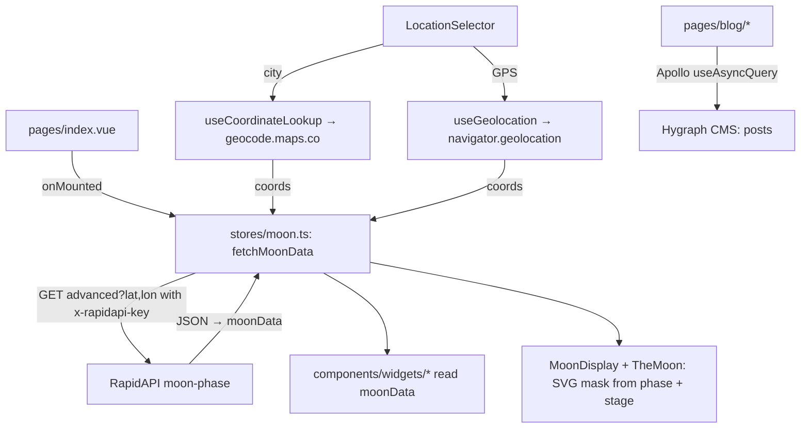
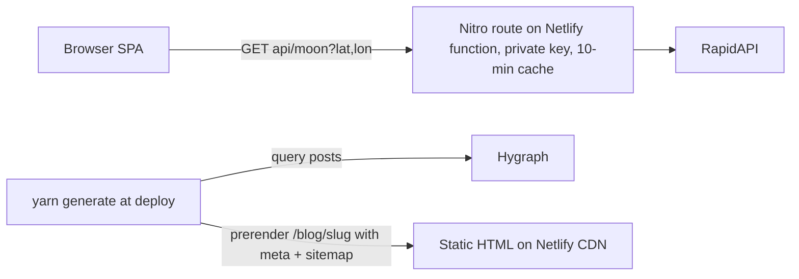

<!--
  PROJECT.md — the cockpit for this repo. One file to open and know where things stand.
  Maintained by the `project-cockpit` skill. The assessment (status/issues/roadmap) is
  refreshed each session; the Diary at the bottom only grows. App-code changes need a
  green light; main is merged to only when sure.
-->
<!-- clickup_list:901508497689 -->

# LUNATRACK (moon-cal) — cockpit

**What it is** · A moon-phase app for moon nerds: today's phase, illumination, age, moon/sun sign, rise/set, next full moon and viewing tips, for a chosen location. Plus a Hygraph-backed blog (8 posts live).
**Stack** · Nuxt 3.16 (SPA, `ssr: false`) · Vue 3.5 · Pinia 3 · Tailwind 3.4 · Apollo/GraphQL (Hygraph blog) · RapidAPI moon-phase (PRO plan) · geocode.maps.co · Umami analytics · Netlify
**Status** · 🟡 rough — the **live site still runs the old code** (`origin/main`, built 2025-04): the moon-image fix from 2026-09-06 sits unmerged on `renewal-fixes`, and local `main` has **diverged** from `origin/main` (5 ahead, 1 behind, conflict in `TheMoon.vue`). On live: both API keys are readable by any visitor, mobile LCP is 25 s, and the Next Lunar Eclipse card is permanently `--`. The API data itself is correct (re-verified today). Build is green.
**Repo** · `github.com/Hersh3yy/moon-cal` · working on `renewal-fixes` (merge to `main` only when sure) · uncommitted WIP on it (see n6)
**Hosting** · Netlify (site `cute-bienenstitch-4060c5` → lunatrack.info), Nuxt SPA build, deploys from `origin/main`
**ClickUp** · Lunatrack list `901508497689` — not synced this session (`CLICKUP_API_KEY` unset in this shell)
**Last assessed** · 2026-10-01

---

## Run it

```bash
yarn install
yarn dev        # nuxt dev → http://localhost:3000 (SPA)
yarn build      # verified green today on Node 24.19 (32 s, 740 KB client bundle)
yarn generate   # static build (what Netlify runs)
```
Needs `.env` with `NUXT_PUBLIC_MOON_API_KEY` (RapidAPI moon-phase) and `NUXT_PUBLIC_GEOCODE_API_KEY` (geocode.maps.co) — see `.env.example`. Without the moon key the homepage shows only an error. Blog needs no key (Hygraph endpoint is hardcoded in `nuxt.config.ts:66`). No tests exist. Lighthouse against live: `npx lighthouse https://lunatrack.info --only-categories=performance,accessibility,best-practices,seo`.

## Status

Grounded today: the live moon API returns correct data for Amsterdam (Waning gibbous · 71% · age 20 · Moon in Gemini · next full = Hunter's Moon 26 Oct), and the app renders it correctly on both desktop and mobile. What's wrong is around the data, not in it: the deploy is stale (the display fixes never reached `main`), the RapidAPI key is shipped to the browser, the 4.3 MB background image makes mobile Lighthouse report **LCP 25.0 s / performance 68**, accessibility scores 88 (icon buttons without names, contrast), and the blog is invisible to search and social scrapers (posts missing from the sitemap, meta tags set client-side only). Lighthouse says SEO 100, but that check is shallow — the real SEO defects are listed below.

The component layer is a flat `widgets/` folder with copy-pasted zodiac tables in three files, two dead widgets, two components both called `Header`, and a vestigial science/astrology display-mode system whose toggle was deleted last session. That's the "atomic design" work: it's a restructure, not a rewrite — the widgets are small and the store is the only state.

## Issues

Grounded by reading every source file, calling the live API, loading the live site on desktop + mobile, and a Lighthouse run. Worst first.

| Sev | Issue | Where |
|---|---|---|
| critical | **Both API keys are public.** `runtimeConfig.public.*` is serialised into `window.__NUXT__.config` for every visitor; the live HTML contains the RapidAPI PRO key and the geocode key in plain text. Anyone can burn the quota/bill. Fix: Nitro server routes `/api/moon` + `/api/geocode` holding the keys in *private* runtime config, with `cachedEventHandler` keyed on rounded lat/lon; Netlify runs them as functions even with `ssr: false`. Rotate the RapidAPI key after the move. | `nuxt.config.ts:90-91` · `stores/moon.ts:181-187` · `useCoordinateLookup.ts:14` · `useGeolocation.ts:59` |
| critical | **Live runs stale code + `main` diverged.** `origin/main` has `7ca356a restore the moon` (2025-04-10) that local `main` lacks; local `main` has 5 commits origin lacks. `renewal-fixes` (the verified moon fix) conflicts with `origin/main` only in `components/TheMoon.vue` — resolve by taking the branch version (it supersedes both). Uncommitted on the branch: `nuxt.config.ts` (adds `site.url`, `sitemap`, `/robots.txt` static rule — good), `main.css` (card shadow), new `widgets/AdWidget.vue` (sponsor card), scratch `widgets/AdWidgetDemo.vue` + `public/_robots.txt`. | git |
| serious | **Mobile LCP 25 s.** `starry-background.jpg` is 6000×4000, 4.3 MB, loaded as a CSS background on every page. Lighthouse: performance 68, total 4,749 KiB, "modern image formats" saves 602 KiB. Plus two render-blocking Google Fonts `@import`s (880 ms) and no preconnect to RapidAPI (310 ms). | `layouts/default.vue:5` · `assets/css/main.css:2-3` |
| serious | **Next Lunar Eclipse card is dead.** The API no longer returns `moon.next_lunar_eclipse` (verified: absent from today's response), so the card renders `--` with no date, permanently. Needs a local eclipse table (NASA canon, 2026–2030 is ~12 rows) or a local ephemeris. | `components/widgets/NextEclipse.vue:6-9` · `stores/moon.ts:151` |
| serious | **Blog SEO is broken in four ways.** (a) live `sitemap.xml` lists only `/` and `/blog` — none of the 8 posts; (b) `ssr: false` means each post's `useSeoMeta` runs in the browser only, so WhatsApp/Twitter/Facebook scrapers see the generic site card, never the post's title/image; (c) `og:image` is a relative path — scrapers need an absolute URL; (d) JSON-LD publisher logo points at `/images/logo.png`, which 404s. Also: `SearchAction` advertises a `/search` route that doesn't exist, `definePageMeta({ ssr: true })` is not a real page-meta key (dead), canonical uses `route.fullPath` (query/hash leak), and the home page has **no `<h1>`** (logo is a link, date is an `h2`, cards are `h3`). | `nuxt.config.ts:21,47,104` · `useSeo.ts:20-21` · `blog/index.vue:53,88` · `blog/[slug].vue:85,322` · `layout/Header.vue:4` |
| warning | **Accessibility (Lighthouse 88).** Five icon-only buttons have no accessible name (geolocate, edit, cancel, hamburger, modal close); hamburger lacks `aria-expanded`; the About modal has no focus trap, no Escape, no focus return; the city input has no `<label>` (floating-label hack on `placeholder=" "`); zodiac `` duplicates the adjacent text (should be `alt=""`); contrast fails on `opacity-50` ranges, `.moon-label{color:#6b7280}` (4.3:1 on black, worse on glass), and `text-gray-600` on the dark blog; a `window.confirm()` interrupts geolocation; no skip link. | `LocationSelector.vue:16,30,46,63,164` · `App/Header.vue:22` · `AboutModal.vue:3,11` · `MoonSign.vue:6` · `SunSign.vue:15` · `OptimalViewing.vue:86` · `blog/[slug].vue:28` |
| warning | **Not atomic.** Zodiac icon map + descriptions + symbols copy-pasted into three widgets (~110 lines each); `SunMoonSign.vue`, `SunMoonTimes.vue`, `AdWidgetDemo.vue` have zero importers; two components named `Header`; the `mode`/`displayMode` prop + `provide/inject` plumbing is vestigial (always `'both'`); `.moon-toggle-btn` CSS for the deleted toggle; `.moon-image-container` CSS with no element; `OptimalViewing` redefines `.moon-card-row` locally and fights the global; `font-helvetica` used but never defined in Tailwind, plus an arbitrary `font-['Helvetica Neue']`; `error.vue` is a white light-theme page on a black site; `useSeo` declares `themeColor '#ffffff'` + `colorScheme 'light dark'` for a dark-only site. | `MoonSign.vue:47` · `SunSign.vue:46` · `SunMoonSign.vue:63` · `BaseCard.vue:5,34` · `index.vue:36` · `main.css:41-50` · `MoonDisplay.vue:62` · `OptimalViewing.vue:93` · `App/Header.vue:15,39` · `LocationSelector.vue:8,45` · `error.vue:2` · `useSeo.ts:63-64` |
| warning | **Blog correctness.** `YYYY-MM-DD` dates parsed as UTC → off-by-one day west of Greenwich (still open from the last audit; only NextFullMoon was fixed). Hand-rolled 90-line `renderContentJson` builds HTML by string concat with unescaped `text`/`src`/`href` (XSS surface; Hygraph's `@graphcms/rich-text-vue-renderer` replaces it and deletes code). `useAsyncQuery` is called inside `onMounted → loadPost`, outside setup — works by accident in SPA mode. An empty tag `""` in Hygraph renders an empty pill. The README claims a blog share button exists; there is none. | `blog/index.vue:26,182` · `blog/[slug].vue:178,204,216,297` |
| warning | **Moon image, hemisphere.** The mask assumes a northern-hemisphere viewer (waxing = lit on the right); for `lat < 0` the disc should be flipped. Rotating by `parallactic_angle` is an approximation — the bright-limb position angle is what orients the terminator. Fine for Amsterdam; wrong for Sydney. | `TheMoon.vue:46-49,74-84` |
| cleanup | Dead deps (`graphql-request`, `@headlessui/vue`, `@nuxtjs/seo` — in `package.json`, zero imports, not in `modules`). 7 of 8 moon-phase PNGs unused (1.2 MB; only `full-moon.png` is referenced). `graphqlEndpoint` runtime config unused. `moon_phases` legacy fallback for a response shape the API no longer sends. Five `console.log`s ship to prod. Package named `nuxt-app`. README is a stale 7-line TODO. | `package.json` · `public/images/moon-phase-images/` · `nuxt.config.ts:92` · `NextFullMoon.vue:54-56` · `stores/moon.ts:171-250` |

**Packages** (`yarn outdated`, 2026-10-01): take now — nuxt 3.16.1→3.21.11, vue 3.5.13→3.5.43, typescript 5.8→5.9, pinia 3.0.1→3.0.4, tailwindcss 3.4.17→3.4.19, graphql 16.10→16.14, postcss/autoprefixer minors. Stage behind `yarn build` — Nuxt 4.5, Tailwind 4.3 (CSS-first config), pinia 4 + @pinia/nuxt 1, @nuxtjs/sitemap 8, @nuxtjs/robots 6, TypeScript 7. Drop or adopt `@nuxtjs/seo` (if adopted, it bundles robots + sitemap + og-image + schema-org and replaces three deps).

## Guide

**Shape of the app.** One Pinia store (`stores/moon.ts`) holds `moonData` (the raw API JSON, typed as `MoonData`), `coordinates` (default Amsterdam 52.3676, 4.9041), `cityName`, `loading`, `error`. `pages/index.vue` calls `fetchMoonData()` on mount; every widget in `components/widgets/*` reads fields straight off `moonData` via `storeToRefs`. `LocationSelector` is the only writer: typed city → `useCoordinateLookup` (geocode.maps.co) → coords → refetch; the geolocate button → `useGeolocation` → coords → refetch → reverse-geocode for a name. The blog is a separate world: Apollo → Hygraph (hardcoded endpoint), rendered client-side.



**Target shape after n7 + n11** — keys leave the browser, blog gets static HTML:



**Where things live.** Hero = `MoonDisplay.vue` (phase name, illumination, viewing line) wrapping `TheMoon.vue` (the SVG shadow mask). Cards = `ui/BaseCard.vue` (glass card, `colSpan` 1|2) used by every widget. Site chrome = `App/Header.vue` (nav + About modal) and `layout/Header.vue` (date + `LocationSelector`). SEO = `composables/useSeo.ts` (home) + inline `useSeoMeta` in the blog pages + global head in `nuxt.config.ts`. Zodiac icons `assets/images/zodiac/*.svg`, full-moon-name icons `assets/images/full-moon-types/*.png`.

**Domain words (keep them).** `phase` 0→1 (0 new, 0.5 full), `stage` waxing/waning, `illumination` "71%", `age_days`, `lunar_cycle` "71.45%", `upcoming_phases.{new_moon,first_quarter,full_moon,last_quarter}.{last,next}` each with `timestamp`, `datestamp`, `days_ahead`/`days_ago`, and for full moons a `name` + `description`; `zodiac.{sun_sign,moon_sign}`; `detailed.position.{altitude,azimuth,distance,parallactic_angle,phase_angle}`; `detailed.visibility.*` and `events.optimal_viewing_period` carry the viewing-tip prose; `sun.{sunrise_timestamp,sunset_timestamp,solar_noon,day_length,position}` — the `_timestamp` fields are pre-formatted `"07:41"` strings, the bare `sunrise`/`sunset` are epoch seconds.

## Hard parts

### Drawing a moon at the right phase

🔭 **What it does** — A moon-phase image is a full-moon sprite with a shadow mask laid over it. The terminator (the light/dark boundary) is a half-ellipse whose horizontal radius tracks `|cos(2π·phase)|`: at new or full it's the full disc width, at the quarters it collapses to a straight line. `stage` picks the lit side (waxing = right, waning = left, northern hemisphere). The fix on `renewal-fixes` also closes the end-of-cycle wrap: `phase → 1` is new, not full.

⚖️ **Why this way** — The API gives `phase` and `stage`; deriving the terminator from them is 20 lines and exact. A phase-indexed image set (the README's old idea) is 30 PNGs and still jumps between frames. What's still missing: a hemisphere flip for `lat < 0`, and the bright-limb position angle instead of the parallactic angle for the rotation.

🗣️ **Say it to a senior** — "The moon is a sprite under an SVG mask; the terminator is an ellipse whose x-radius is |cos| of the phase angle, the lit side comes from the waxing/waning stage, and we still owe southern-hemisphere viewers a flip."

---

### Why the API key is on every visitor's screen

🔭 **What it does** — Nuxt serialises everything under `runtimeConfig.public` into a `<script>` in the HTML (`window.__NUXT__.config.public`) so the client bundle can read it — by design, public means public. In an `ssr: false` app it's tempting to think "there is no server", but Netlify still deploys Nitro as a function, so a file at `server/api/moon.get.ts` runs server-side with a *private* `runtimeConfig.moonApiKey`, and the browser only ever calls `/api/moon`. Wrapping the handler in `cachedEventHandler` with a key of lat/lon rounded to two decimals means a thousand Amsterdam visitors cost one RapidAPI call per ten minutes.

⚖️ **Why this way** — The alternative (RapidAPI referer/domain restriction) doesn't exist for RapidAPI keys, and obfuscation isn't security. The proxy also fixes a second thing: today each visitor's first paint waits on an uncached third-party call.

🗣️ **Say it to a senior** — "Public runtime config is shipped to the browser by definition; the key belongs behind a Nitro route, which Netlify runs as a function regardless of ssr:false, and the route's cache turns N visitors into one upstream call."

---

### Why a date shows the wrong day

🔭 **What it does** — `new Date('2025-02-14')` parses a date-only string as **UTC midnight**; `toLocaleDateString()` then renders it in the *viewer's* timezone, so anyone west of Greenwich sees 13 February. The blog still does this (`blog/index.vue:182`, `blog/[slug].vue:204`). The old `new Date(0)` fallback that printed "1/1/1970" in NextFullMoon is gone.

⚖️ **Why this way** — Parse date-only strings as local (`new Date(y, m-1, d)`) or format with `timeZone: 'UTC'`, and never fall back to epoch 0.

🗣️ **Say it to a senior** — "Date-only ISO strings parse as UTC midnight and render in the viewer's zone, so they drift a day; parse them as local and treat a missing timestamp as missing, not as 1970."

---

### Why shared blog links show the wrong card

🔭 **What it does** — With `ssr: false` every route serves the same empty shell; the post's title, description and image are injected by JavaScript after Apollo answers. Googlebot executes JS (slowly, in a second wave), but WhatsApp, iMessage, Slack, X and Facebook scrapers do not — they read the first HTML response, which carries only the generic "Lunatrack - Your Lunar Guide" tags. The sitemap has the same blind spot: `@nuxtjs/sitemap` only knows routes it can discover at build time, and dynamic `[slug]` pages need a `sources` endpoint that lists them.

⚖️ **Why this way** — Prerendering the blog at build (`ssr: true` globally, `routeRules: { '/': { ssr: false } }` to keep the API-driven home client-only, and a `prerender:routes` hook that queries Hygraph) gives each post real HTML with real meta on the CDN, no server at runtime. Full SSR on Netlify functions would also work but adds cold starts and a runtime dependency on Hygraph for every hit.

🗣️ **Say it to a senior** — "Social scrapers don't run JavaScript, so a client-rendered post always shares as the homepage card; prerendering the blog at build time fixes the meta, the sitemap and the crawl budget in one move."

## Roadmap — near future

Triage: n6–n9 and n12 are small, safe, high-confidence — one or two sittings total with a green light. n10, n11 and n13 are real work with decisions in them.

- [x] Fix the moon image: correct the end-of-cycle inversion and draw the terminator from illumination %, or swap to a phase-indexed image set (the README's "accurate moon images for each day") <!-- id:n1 cu:123kjkdhp64 -->
- [x] Fix MoonSign to stop showing sun-sign date ranges (drop the month span, or show the ~2-day moon transit) <!-- id:n2 cu:123kjkdhp65 -->
- [x] ~~Format sun/moon rise-set times~~ — **verified already correct**: the time widgets use the API's pre-formatted string fields (`"06:59"`, `"00:10"`), not the epoch fields. The audit over-flagged this; nothing to change. <!-- id:n3 cu:123kjkdhp66 -->
- [x] Fix date rendering: no 1970 fallback, parse date-only strings without the UTC off-by-one, show the location's day not the viewer's <!-- id:n4 cu:123kjkdhp67 -->
- [x] Replace the `lastIndexOf('}}')` truncation with `response.json()`; surface the missing-field warning instead of swallowing it <!-- id:n5 cu:123kjkdhp68 -->
- [ ] **Branch hygiene + ship the fixes.** Commit the WIP (`nuxt.config.ts` site/sitemap/robots, card shadow, `AdWidget.vue`); delete scratch `AdWidgetDemo.vue` + `public/_robots.txt`; merge `origin/main` into `renewal-fixes` taking the branch's `TheMoon.vue`; `yarn build`; merge to `main`, push (Netlify deploys the moon fix); delete `renewal-fixes`; continue on one new branch `renewal-2`. <!-- id:n6 -->
- [ ] **Hide the API keys.** `server/api/moon.get.ts` + `server/api/geocode.get.ts` with private `runtimeConfig.moonApiKey`/`geocodeApiKey`, `cachedEventHandler` (10 min, lat/lon rounded to 2 dp), store + composables call `/api/*`; `.env.example` updated; **rotate the RapidAPI key** after deploy. Done when the live HTML no longer contains a key. <!-- id:n7 -->
- [ ] **Quick-fix batch** (all small, all safe, one sitting): `aria-label` on the 5 icon buttons, `aria-expanded` on the hamburger, Escape + focus trap + focus return on the About modal, a real `<label>` for the city input, `alt=""` on decorative zodiac/full-moon icons, an `<h1>` on the home page, absolute `og:image`, drop the `SearchAction` + the 404 logo from JSON-LD, canonical from `route.path`, `themeColor` dark + `colorScheme 'dark'`, parse blog dates as local, filter empty tags, strip `console.log`, delete `SunMoonSign`/`SunMoonTimes`/dead CSS/7 unused PNGs/3 dead deps/`graphqlEndpoint`/`moon_phases` fallback, define `font-helvetica` or drop it, dark `error.vue`, rename package to `lunatrack`, replace `window.confirm` with an inline hint. <!-- id:n8 -->
- [ ] **Performance.** Resize `starry-background.jpg` to 1920 w AVIF + WebP (~150–250 KB) via `@nuxt/image` or a committed file; fonts via `@nuxtjs/google-fonts` (preload, `display=swap`) or self-host Audiowide + Poppins; `preconnect` to the API host. Done when mobile Lighthouse shows LCP < 2.5 s and performance ≥ 90. <!-- id:n9 -->
- [ ] **Atomic design restructure.** `components/atoms` (Logo, IconButton, Stat, Pill, Spinner), `molecules` (StatRow, CardHeader, LocationChip, NavMenu, PhaseCountdown), `organisms` (SiteHeader, MoonHero, LocationSelector, AboutModal, WidgetGrid, the widgets); `components: [{ path: '~/components', pathPrefix: false }]`; one shared `data/zodiac.ts` + `data/fullMoons.ts`; `types/moon.ts` extracted from the store; a `useMoon()` composable of named selectors (illumination %, next phases, distance context) so widgets stop reaching into raw JSON; remove the `mode`/`displayMode` plumbing; design tokens in `tailwind.config.js` (ink, surface, glow, display/body fonts); one `Header`. Done when every widget is < 40 lines and no data table is duplicated. <!-- id:n10 -->
- [ ] **Blog SEO + hygiene.** `ssr: true` with `routeRules '/': { ssr: false }`; prerender `/blog` + every `/blog/[slug]` from Hygraph via a `prerender:routes` hook; `sitemap.sources` server route listing posts; per-post absolute OG image; `@graphcms/rich-text-vue-renderer` instead of `renderContentJson`; `useAsyncQuery` at setup level, not in `onMounted`; dark-theme blog cards + `text-gray-*` → tokens; real share button (Web Share API + copy link); reading time. Done when a shared post link previews with its own title/image and `sitemap.xml` lists every post. <!-- id:n11 -->
- [ ] **Fix Next Lunar Eclipse.** Ship a local table of lunar (and solar) eclipses 2026–2030 from the NASA canon with type + visibility regions, pick the next one after today; or compute via `astronomy-engine` (see f9). Done when the card shows a real date. <!-- id:n12 -->
- [ ] **Package currency.** Take the minors/patches now (`yarn upgrade` nuxt 3.21, vue 3.5.43, typescript 5.9, pinia 3.0.4, tailwind 3.4.19, graphql 16.14, postcss, autoprefixer) and verify with `yarn build`; then stage each major separately behind the build: Nuxt 4, Tailwind 4, pinia 4 + @pinia/nuxt 1, sitemap 8, robots 6, TypeScript 7. Decide `@nuxtjs/seo`: adopt (replaces robots + sitemap deps) or drop. <!-- id:n13 -->

## Roadmap — far future

Tracks, not a schedule. f7/f8 are the "more stats" you asked for; f9 is the strategic one that unlocks f10, f13 and f15.

- [x] Remove dead code: deleted `stores/posts.ts`, `DebugInfo.vue`, `ModeToggle.vue`, the duplicate `useMoonImage.ts` (all zero importers). The redundant second header (`layout/Header` vs `App/Header`) was left — it's layout tidy-up, not dead code; spin off if wanted. <!-- id:f1 cu:123kjkdhp69 -->
- [ ] Sanitize blog `v-html` (XSS) — covered by n11's switch to `@graphcms/rich-text-vue-renderer`; tick when n11 lands <!-- id:f2 cu:123kjkdhp6a -->
- [ ] Auto-detect location on first load (currently hard-defaults to Amsterdam); ask with an inline explanation, fall back to IP-based city via the geocode proxy, remember the choice in `localStorage` <!-- id:f3 cu:123kjkdhp6b -->
- [x] Document the required API keys in `.env.example` <!-- id:f4 cu:123kjkdhp6c -->
- [ ] Decide SPA vs SSR for blog SEO — decided: hybrid (prerendered blog, client-only home), implemented by n11; tick when n11 lands <!-- id:f5 cu:123kjkdhp6d -->
- [ ] 3D moon render + i18n (README TODOs; favicon exists, title done). 3D: `three` + NASA CGI Moon Kit colour + displacement maps (~600 KB, lazy-loaded behind a "3D" toggle), lit from the real sun direction (`phase_angle`). i18n: `@nuxtjs/i18n` with `en` + `nl`. <!-- id:f6 cu:123kjkdhp6e -->
- [ ] **Stats pack A — already in the API, zero new fetches.** (1) *Moon position now*: `detailed.position.altitude/azimuth` → "Below the horizon · rises 21:02 in the NNE" with a compass rose. (2) *Lunar-cycle ring* around the hero moon from `lunar_cycle` %. (3) *Next-four-phases strip*: new / first quarter / full / last quarter with `days_ahead` countdowns — the "moon calendar" people search for. (4) *Last full moon*: "Harvest Moon, 4 days ago" from `full_moon.last`. (5) *Distance gauge* perigee 356k ↔ apogee 406k km with a "supermoon" badge when a full moon falls within ~90% of perigee. (6) *Angular size*: `2·atan(1737.4 / distance_km)` in arcminutes vs the 31.1′ mean — "3% bigger than average tonight". (7) *Observer's kit*: `visibility_rating`, `visible_hours`, `recommended_equipment` (telescope, magnification, filter). (8) *Sun extras*: solar noon, Earth–Sun distance (`sun.position.distance`, perihelion/aphelion context), sun altitude now, golden/blue hour derived from sunrise/sunset. (9) *24-hour sky timeline*: one bar with the sun band and the moon band — replaces the two time cards with one visual. (10) Nerd row: `phase_angle`, `visible_fraction`. <!-- id:f7 -->
- [ ] **Stats pack B — computed locally, no API.** *Tides*: spring tides at new/full, neap at the quarters (from `phase`). *Earthshine*: when illumination < ~25%, "look for the ghostly dark side just after sunset". *Blue moon*: two full moons in one calendar month, from `upcoming_phases`. *Lunation number* (Brown): `floor((JD − 2451550.1) / 29.530588853) + 953`. *Hemisphere-correct moon*: flip the mask for `lat < 0` and say "this is how it looks from where you are". *Lunar-calendar holidays*: Ramadan/Eid, Chinese New Year, Easter (first Sunday after the first full moon after 21 March), Diwali — all derivable from new/full-moon dates. <!-- id:f8 -->
- [ ] **Local ephemeris with `astronomy-engine`** (MIT, ~100 KB, Meeus-grade): phases, illumination, rise/set, ecliptic longitude → zodiac sign, lunar/solar eclipse search, perigee/apogee, positions — all offline. Removes the RapidAPI dependency (the key problem, the quota, and the three "API response changed again" commits in history), keeps the API's prose (full-moon names, viewing tips) as small local tables, and makes unlimited prerendered pages free. Also unlocks a *time scrubber* ("drag to see the moon over the next 30 days") and "the moon on your birthday". Stage behind a side-by-side comparison with the API for a month. <!-- id:f9 -->
- [ ] **Programmatic SEO pages** (needs f9 or careful API budgeting): `/full-moon-calendar/2026` (and per year), `/moon-phase-today`, `/moon/<city>` for the top ~50 cities, `/moon-phase/<YYYY-MM-DD>`, each prerendered with its own title/description/OG — "full moon october 2026" is the traffic magnet. A daily Netlify scheduled build hook so the prerendered home carries today's phase in its title ("Waning gibbous 71% · Moon phase today"). `nuxt-og-image` to render today's moon card for shares. <!-- id:f10 -->
- [ ] **Glossary / FAQ pages** with `FAQPage` JSON-LD: one explainer per phase name, "star sign vs moon sign", "what is a supermoon"; and internal links from each widget to its explainer or blog post (MoonSign → the star-vs-moon-sign post). <!-- id:f11 -->
- [ ] **PWA**: `@vite-pwa/nuxt` manifest + install prompt; later a "full moon tonight" push notification. Moon nerds check daily — a home-screen icon is the retention play. <!-- id:f12 -->
- [ ] **Design polish**: a one-line "Tonight" summary above the fold ("Waning gibbous, 71% lit, rises 21:02 in the NNE, best after 22:00"); glow intensity tied to illumination; subtle CSS parallax starfield (reduced-motion aware); Audiowide for numbers only, Poppins for prose; related posts by tag on the blog. <!-- id:f13 -->
- [ ] **Sponsor slot decision**: `AdWidget.vue` (uncommitted) — keep one clearly-labelled "Sponsor" card at the grid's end, or drop it. <!-- id:f14 -->
- [ ] **Hygraph hygiene**: add `seoTitle`/`seoDescription`/`updatedAt` to the Post model (so `dateModified` is honest), clean the empty tag on the sleep post, add `readingTime` or compute it. <!-- id:f15 -->

---

## Diary

### 2026-10-01 — full re-assessment for the renewal (no code changed)
- Re-read every source file, called the live API (data correct: Waning gibbous · 71% · Gemini), loaded the live site desktop + mobile, ran Lighthouse (mobile: perf **68**, a11y **88**, best-practices 100, SEO 100; LCP **25.0 s**, 4,749 KiB), checked the live sitemap (2 URLs, no posts), robots (fine), Hygraph (8 posts). `yarn build` green on Node 24.19.
- **Found**: live site runs `origin/main` from 2025-04 — the 2026-09-06 fixes never shipped; local `main` diverged (5 ahead / 1 behind, `TheMoon.vue` conflict). Both API keys readable in the live HTML. Next Lunar Eclipse card dead (API dropped the field). Blog posts invisible to scrapers and absent from the sitemap. Uncommitted WIP on `renewal-fixes` (site/sitemap config, card shadow, `AdWidget.vue`, scratch demo + `_robots.txt`).
- Rewrote the map: issues table regrounded, two Mermaid diagrams (today / target), two new hard-parts blocks (public runtime config; why shared links show the wrong card), roadmap re-cut into n6–n13 (triaged small-safe vs real work) and f7–f15 (stats packs A/B, local ephemeris, programmatic SEO, PWA, polish). README rewritten as the public face (the stale TODO list is gone; roadmap lives here).
- Not done: no app code touched (awaiting green light); ClickUp not synced (`CLICKUP_API_KEY` unset); the RapidAPI key is still live and public until n7 ships.

### 2026-09-06 (later) — fixed it all (branch `renewal-fixes`)
- Green-lit full fix pass, on a branch (not merged). Fixed: the **moon image** (terminator now scales with illumination; the end-of-cycle bright-instead-of-dark inversion is gone — verified numerically across the phase cycle); the **moon sign** no longer prints a month-long sun-sign range; **NextFullMoon** date is formatted and guarded (no "1/1/1970"); the store **fetch** uses `response.json()` instead of the `}}` truncation; deleted 4 dead files. `.env.example` documented. `yarn build` green on Node 24.
- Grounded correction: re-called the live API and found the **time widgets were already correct** (they use the API's pre-formatted `"06:59"` strings, not the epoch fields) — the first audit over-flagged them. NextEclipse already guards its missing case.
- Left as tasks (secondary): blog `v-html` XSS, first-load location auto-detect, SPA-vs-SSR for blog SEO, the redundant second header.

### 2026-09-06 — first cockpit + grounded audit
- Audited the whole app and **called the live moon API** to check the "bad data" complaint. Finding: the API data is correct; the bad data is the display layer (moon image inversion, moon-sign showing sun-sign ranges, raw/timezone-wrong times/dates).
- Corrected the audit's headline: the JSON-truncation hack is latent, not currently losing data (this response ends `}}}}`).
- No code changed — assessment only, pending green light. Roadmap leads with the three visible bugs.
